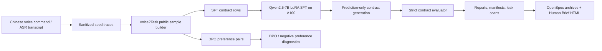

# Voice2Task Post-Training

[中文](README.md) | [English](README_en.md)


Voice2Task Post-Training 是一个证据优先的中文语音到浏览器任务合约微调项目。它把中文口语命令或 ASR 文本转换成安全、可评估、可复现的 browser task contract JSON，并用 SFT/DPO 数据、7B LoRA 训练路径、严格评估和公开安全证据包来回答一个很窄但很关键的问题：

> 模型是否真的学会了把自然中文指令稳定写成可执行任务合约，而不是只在训练样本上背格式。

当前结论很保守：7B LoRA 路径已经能在 A100 私有运行环境中跑通，训练 split 可以达到严格 exact match 1.0000，但公开样本 held-out 仍停在 dev 0.5000 / test 0.8333。也就是说，基础管线不是主要瓶颈，下一阶段重点是 slot-value family 的数据泛化和 held-out residual 设计。

## TL;DR

- 输入：中文语音命令、ASR transcript、浏览器任务意图。
- 输出：严格 schema 的 browser task contract JSON。
- 数据：提交版 public sample 包含 42 条 SFT row、125 对 DPO preference pair，split 为 train/dev/test = 30/6/6。
- 模型路径：Qwen2.5-7B-Instruct + LoRA，重训练和推理证据在 A100 私有环境完成，权重和 adapter 不进入 Git。
- 最新公开证据：A100 merged slot-value adapter 已恢复；hardened canonical prompt 的 prediction-only rerun 对 held-out exact match 没有改善。
- 当前能力边界：可以证明训练路径和评估路径真实可运行；不能宣称已经达到生产级、私有语料泛化、live browser benchmark 提升或 released checkpoint。

## 当前快照

| 项目 | 状态 |
| --- | --- |
| Public sample | 42 SFT rows, 125 DPO pairs |
| Public split | train 30 / dev 6 / test 6 |
| Base model | Qwen/Qwen2.5-7B-Instruct |
| Adapter state | A100 merged slot-value adapter restored/regenerated, not released |
| Latest rerun | prediction-only hardened canonical policy rerun |
| Strict exact match | train 1.0000 / dev 0.5000 / test 0.8333 |
| Interpretation | held-out unchanged; no model recovery claim |

## 项目定位

| This repo is | This repo is not |
| --- | --- |
| 一个 speech/ASR-to-contract post-training 实验仓库 | 一个通用聊天微调项目 |
| 一个严格 JSON contract 生成与评估管线 | 一个 GUI action policy 或 browser controller |
| 一个 SFT/DPO 数据、训练、预测、评估的可审计流水线 | 一个发布 checkpoint 或 adapter 的模型仓库 |
| 一个区分 train memorization 和 held-out generalization 的证据仓库 | 一个用 soft metric 包装成功的结果展示 |
| 一个公开安全的 evidence map | 一个包含私有语料、远端路径、SSH 信息或原始日志的仓库 |

## Architecture



## What Is Implemented

| Area | Files |
| --- | --- |
| Dataset generation and validation | `src/voice2task/dataset.py`, `src/voice2task/validation.py`, `data/public-samples/` |
| Contract schema and evaluator | `src/voice2task/schemas.py`, `src/voice2task/evaluation.py` |
| SFT/DPO formatting | `src/voice2task/formatting.py`, `src/voice2task/dpo.py` |
| Training and prediction gates | `src/voice2task/training.py`, `configs/` |
| CLI surfaces | `src/voice2task/cli/data.py`, `src/voice2task/cli/train.py`, `src/voice2task/cli/eval.py`, `src/voice2task/cli/report.py` |
| Public-safe evidence | `reports/public-sample/`, `docs/human-briefs/`, `openspec/changes/archive/` |

## 3-Minute Reviewer Path

1. Read the current boundary: [`reports/public-sample/a100-hardened-canonical-policy-rerun-observed/report.md`](reports/public-sample/a100-hardened-canonical-policy-rerun-observed/report.md).
2. Check the prerequisite adapter evidence: [`reports/public-sample/a100-merged-slot-value-adapter-restore/report.md`](reports/public-sample/a100-merged-slot-value-adapter-restore/report.md).
3. Inspect the formal public sample manifest: [`data/public-samples/manifest_public_sample.json`](data/public-samples/manifest_public_sample.json).
4. Skim the Chinese phase brief: [`docs/human-briefs/2026-06-15-autonomous-loop-restore-and-observe-hardened-rerun.html`](docs/human-briefs/2026-06-15-autonomous-loop-restore-and-observe-hardened-rerun.html).
5. Inspect the archived OpenSpec changes if you want the full decision trail: [`openspec/changes/archive/2026-06-15-observe-a100-hardened-canonical-policy-rerun/proposal.md`](openspec/changes/archive/2026-06-15-observe-a100-hardened-canonical-policy-rerun/proposal.md).

## Quick Start

Install local tooling:

```bash
python -m venv .venv
source .venv/bin/activate
pip install -e '.[dev,dataset]'
```

Rebuild and validate the committed public sample:

```bash
PYTHONPATH=src python -m voice2task.cli.data build-public \
  --seed data/public-samples/seed_traces.jsonl \
  --output data/public-samples

PYTHONPATH=src python -m voice2task.cli.data validate \
  --sft data/public-samples/sft_public_sample.jsonl \
  --dpo data/public-samples/dpo_public_sample.jsonl \
  --manifest data/public-samples/manifest_public_sample.json \
  --public
```

Run local baselines and metrics:

```bash
PYTHONPATH=src python -m voice2task.cli.eval baseline \
  --gold data/public-samples/sft_public_sample.jsonl \
  --output reports/public-sample/rule_baseline_predictions.jsonl

PYTHONPATH=src python -m voice2task.cli.eval metrics \
  --gold data/public-samples/sft_public_sample.jsonl \
  --predictions reports/public-sample/rule_baseline_predictions.jsonl \
  --output reports/public-sample
```

Run dry-run training metadata export:

```bash
PYTHONPATH=src python -m voice2task.cli.train sft \
  --config configs/sft-dev.json \
  --manifest data/public-samples/manifest_public_sample.json \
  --output-dir reports/public-sample/sft-dry-run \
  --dry-run

PYTHONPATH=src python -m voice2task.cli.train dpo \
  --config configs/dpo-dev.json \
  --manifest data/public-samples/manifest_public_sample.json \
  --output-dir reports/public-sample/dpo-dry-run \
  --dry-run
```

Heavy training is explicitly gated. A real SFT/DPO run requires both `--run-training` and a config with `allow_heavy_training: true`; unresolved template roots keep the run from starting.

## A100 Boundary

GPU-heavy training and prediction are designed for a private A100 development machine. Public repo artifacts intentionally omit:

- checkpoints, LoRA adapters, raw logs, remote caches, and model downloads;
- private corpus rows and full local seed exports;
- hostnames, SSH details, credentials, private paths, and private override configs;
- production-readiness, live-browser benchmark, private-corpus generalization, or checkpoint-release claims.

Prediction-only private runs should write sanitized public-sample outputs and metadata, then commit only aggregate reports, manifests, leak-scan results, and public-safe summaries.

## Evidence Map

| Evidence | What it proves | What it does not prove |
| --- | --- | --- |
| [`a100-merged-slot-value-adapter-restore`](reports/public-sample/a100-merged-slot-value-adapter-restore/report.md) | The private 7B adapter prerequisite was available/regenerated on A100 | Model recovery, checkpoint release, public adapter availability |
| [`a100-hardened-canonical-policy-rerun-observed`](reports/public-sample/a100-hardened-canonical-policy-rerun-observed/report.md) | Prediction-only rerun emitted schema-valid public-sample contracts and preserved strict metrics | Held-out recovery, evaluator relaxation, semantic scoring |
| [`a100-merged-slot-value-heldout-eval`](reports/public-sample/a100-merged-slot-value-heldout-eval/report.md) | Earlier merged slot-value adapter evaluation boundary | Production or full private-corpus generalization |
| [`docs/human-briefs/`](docs/human-briefs/) | Chinese human-readable phase summaries | Source of truth for specs or metrics |
| [`openspec/changes/archive/`](openspec/changes/archive/) | Durable proposal/design/task history | Runtime evidence by itself |

## Metric Interpretation Boundaries

`contract_exact_match` is a hard full-contract exact-match metric. `normalized_command` string-mismatch diagnostics are explanatory row-level evidence only: they do not relax, normalize, semantically score, repair, replace, or re-score predictions, and they do not automatically mark Chinese phrase differences such as `搜索/查询` or `明天的天气/明天天气` as equivalent.

The latest result therefore reads as:

- train exact match = 1.0000: training-path memorization and output format are working;
- dev exact match = 0.5000 and test exact match = 0.8333: held-out behavior is still uneven;
- hardened prompt delta = 0.0000 on dev/test: prompt hardening alone did not solve the residuals.

## Normalized Command Target Policy

`normalized_command` gold targets are canonical Chinese intent phrases, not verbatim transcripts or ASR text. First-phase public samples use concise target phrases such as `搜索北京明天天气`, `打开示例网站`, `填写邮箱并确认`, and `拒绝代替用户付款`; schema-preserving paraphrases keep the same target contract. This is target-writing guidance for SFT/DPO data and prompts, not evaluator-side normalization, semantic-equivalence scoring, prediction repair, or re-scoring.

## Recommended Next Stage

The next useful phase is not another broad rerun. The evidence points to data generalization work:

1. expand held-out slot-value families with deliberately varied but schema-stable cases;
2. keep train/dev/test family separation explicit;
3. run prediction-only evaluation on the same strict evaluator;
4. only claim progress if held-out `contract_exact_match` improves without changing the evaluator or repairing predictions.

## Validation

Useful local checks:

```bash
PYTHONPATH=src pytest -q
OPENSPEC_TELEMETRY=0 openspec validate --all --strict
PYTHONPATH=src python -m voice2task.cli.report leak-scan README.md README_en.md reports/public-sample
git diff --check
```

## License

The package metadata declares an MIT license. A standalone `LICENSE` file should be added before presenting the repository as an open-source release.
