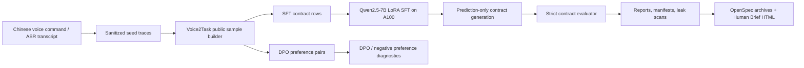

# Voice2Task Post-Training

[中文](README.md) | [English](README_en.md)


Voice2Task Post-Training 是一个证据优先的中文语音到浏览器任务合约微调项目。它把中文口语命令或 ASR 文本转换成安全、可评估、可复现的 browser task contract JSON，并用 SFT/DPO 数据、7B LoRA 训练路径、严格评估和公开安全证据包来回答一个很窄但很关键的问题：

> 模型是否真的学会了把自然中文指令稳定写成可执行任务合约，而不是只在训练样本上背格式。

当前结论很保守：7B LoRA 路径已经能在 A100 私有运行环境中跑通。最新 current evidence 是 recovered-input Contract V2 projection rerun：已使用恢复后的 step-matched Control/Treatment dev/test prediction contracts 和 dev/test gold contracts 离线重跑 projection。结论是 `PARTIAL_SCHEMA_BENEFIT`：移除 derived/display fields 带来小幅 strict exact 改善，但 V2 core executable pass 没有改善，slot bottleneck 仍然主导，因此当前仍不能宣称正式 Contract V2 值得实施、模型能力提升、held-out recovery、生产级或安全 readiness。

## TL;DR

- 输入：中文语音命令、ASR transcript、浏览器任务意图。
- 输出：严格 schema 的 browser task contract JSON。
- 数据：当前 formal public sample 边界是 `public-sample-20260619T090925Z`，包含 247 条 seed、696 条 SFT row、2100 对 DPO preference pair，split 为 train/dev/test = 282/207/207。旧 77 seeds / 231 SFT rows / 661 DPO pairs 属于历史边界。
- 模型路径：Qwen2.5-7B-Instruct + LoRA，重训练和推理证据在 A100 私有环境完成，权重和 adapter 不进入 Git。
- 最新公开证据：[`contract-v2-projection/rerun-with-recovered-inputs`](reports/public-sample/contract-v2-projection/rerun-with-recovered-inputs/summary.md) 使用已恢复 step-matched raw inputs 重跑 Contract V2 projection；输入恢复证据在 [`raw-inputs`](reports/public-sample/step-matched-canonical-slot-ablation/raw-inputs/recovery-summary.md)。
- 当前能力边界：可以证明训练、预测和评估路径真实可运行；不能宣称 canonical slot data 带来稳定收益、held-out recovery、生产级、私有语料泛化、live browser benchmark 提升或 released checkpoint。

## 当前快照

| 项目 | 状态 |
| --- | --- |
| Public sample | current: 247 seeds, 696 SFT rows, 2100 DPO pairs; historical: 77 seeds, 231 SFT rows, 661 DPO pairs |
| Public split | current: train 282 / dev 207 / test 207; historical: train 93 / dev 69 / test 69 |
| Base model | Qwen/Qwen2.5-7B-Instruct |
| Adapter state | step-matched Control / Treatment private A100 adapters observed, not released |
| Latest evidence | Recovered-input Contract V2 projection rerun |
| Optimizer-step budget | Control and Treatment both use 3132 optimizer steps |
| Strict exact match | Control dev 0.8357 / test 0.7778; Treatment dev 0.8357 / test 0.7923 |
| Executable pass | Control dev 0.8551 / test 0.8213; Treatment dev 0.8647 / test 0.8164 |
| Projection decision | `PARTIAL_SCHEMA_BENEFIT` under `reports/public-sample/contract-v2-projection/rerun-with-recovered-inputs/` |
| Interpretation | recovered-input projection improves V2 core exact by +0.0193/+0.0386 Control dev/test and +0.0290/+0.0242 Treatment dev/test; V2 executable pass does not improve and slot failures remain dominant |
| Next bounded action | `decide-contract-v2-core-implementation-scope` only; do not auto implement Contract V2, train, DPO, or expand data |

## 项目定位

| This repo is | This repo is not |
| --- | --- |
| 一个 speech/ASR-to-contract post-training 实验仓库 | 一个通用聊天微调项目 |
| 一个严格 JSON contract 生成与评估管线 | 一个 GUI action policy 或 browser controller |
| 一个 SFT/DPO 数据、训练、预测、评估的可审计流水线 | 一个发布 checkpoint 或 adapter 的模型仓库 |
| 一个区分 train memorization 和 held-out generalization 的证据仓库 | 一个用 soft metric 包装成功的结果展示 |
| 一个公开安全的 evidence map | 一个包含私有语料、远端路径、SSH 信息或原始日志的仓库 |

## Architecture



## What Is Implemented

| Area | Files |
| --- | --- |
| Dataset generation and validation | `src/voice2task/dataset.py`, `src/voice2task/validation.py`, `data/public-samples/` |
| Contract schema and evaluator | `src/voice2task/schemas.py`, `src/voice2task/evaluation.py` |
| SFT/DPO formatting | `src/voice2task/formatting.py`, `src/voice2task/dpo.py` |
| Training and prediction gates | `src/voice2task/training.py`, `configs/` |
| CLI surfaces | `src/voice2task/cli/data.py`, `src/voice2task/cli/train.py`, `src/voice2task/cli/eval.py`, `src/voice2task/cli/report.py` |
| Public-safe evidence | `reports/public-sample/`, `docs/human-briefs/`, `openspec/changes/archive/` |

## 3-Minute Reviewer Path

1. Read the current projection decision: [`reports/public-sample/contract-v2-projection/rerun-with-recovered-inputs/decision.md`](reports/public-sample/contract-v2-projection/rerun-with-recovered-inputs/decision.md).
2. Inspect required answers and deltas: [`summary.json`](reports/public-sample/contract-v2-projection/rerun-with-recovered-inputs/summary.json).
3. Inspect failure contribution: [`failure-contribution-analysis.md`](reports/public-sample/contract-v2-projection/rerun-with-recovered-inputs/failure-contribution-analysis.md).
4. Inspect recovered input boundary: [`source-boundary.json`](reports/public-sample/contract-v2-projection/rerun-with-recovered-inputs/source-boundary.json).
5. Inspect the source step-matched ablation boundary: [`reports/public-sample/step-matched-canonical-slot-ablation/decision.md`](reports/public-sample/step-matched-canonical-slot-ablation/decision.md).

## Quick Start

Install local tooling:

```bash
python -m venv .venv
source .venv/bin/activate
pip install -e '.[dev,dataset]'
```

Rebuild and validate the committed public sample:

```bash
PYTHONPATH=src python -m voice2task.cli.data build-public \
  --seed data/public-samples/seed_traces.jsonl \
  --output data/public-samples

PYTHONPATH=src python -m voice2task.cli.data validate \
  --sft data/public-samples/sft_public_sample.jsonl \
  --dpo data/public-samples/dpo_public_sample.jsonl \
  --manifest data/public-samples/manifest_public_sample.json \
  --public
```

Run local baselines and metrics:

```bash
PYTHONPATH=src python -m voice2task.cli.eval baseline \
  --gold data/public-samples/sft_public_sample.jsonl \
  --output reports/public-sample/rule_baseline_predictions.jsonl

PYTHONPATH=src python -m voice2task.cli.eval metrics \
  --gold data/public-samples/sft_public_sample.jsonl \
  --predictions reports/public-sample/rule_baseline_predictions.jsonl \
  --output reports/public-sample
```

Run dry-run training metadata export:

```bash
PYTHONPATH=src python -m voice2task.cli.train sft \
  --config configs/sft-dev.json \
  --manifest data/public-samples/manifest_public_sample.json \
  --output-dir reports/public-sample/sft-dry-run \
  --dry-run

PYTHONPATH=src python -m voice2task.cli.train dpo \
  --config configs/dpo-dev.json \
  --manifest data/public-samples/manifest_public_sample.json \
  --output-dir reports/public-sample/dpo-dry-run \
  --dry-run
```

Heavy training is explicitly gated. A real SFT/DPO run requires both `--run-training` and a config with `allow_heavy_training: true`; unresolved template roots keep the run from starting.

## A100 Boundary

GPU-heavy training and prediction are designed for a private A100 development machine. Public repo artifacts intentionally omit:

- checkpoints, LoRA adapters, raw logs, remote caches, and model downloads;
- private corpus rows and full local seed exports;
- hostnames, SSH details, credentials, private paths, and private override configs;
- production-readiness, live-browser benchmark, private-corpus generalization, or checkpoint-release claims.

Prediction-only private runs should write sanitized public-sample outputs and metadata, then commit only aggregate reports, manifests, leak-scan results, and public-safe summaries.

## Evidence Map

| Evidence | What it proves | What it does not prove |
| --- | --- | --- |
| [`contract-v2-projection/rerun-with-recovered-inputs`](reports/public-sample/contract-v2-projection/rerun-with-recovered-inputs/summary.md) | Recovered-input Contract V2 projection rerun completed offline: normalized-command-only share 14.65%, metadata-only share 0%, V2 core exact improves by +0.0193/+0.0386 Control dev/test and +0.0290/+0.0242 Treatment dev/test, renderer support 0.9988, deterministic roundtrip 1.0 | Model improvement, V2 executable improvement, held-out recovery, formal Contract V2 implementation readiness, production or safety readiness |
| [`step-matched-canonical-slot-ablation/raw-inputs`](reports/public-sample/step-matched-canonical-slot-ablation/raw-inputs/recovery-summary.md) | Current raw-input recovery: original step-matched Control/Treatment dev/test predictions and dev/test gold contracts are public-safe, boundary-verified, and reproduce committed aggregate metrics | Contract V2 projection gain, V2 renderer coverage, Contract V2 implementation readiness, retraining justification |
| [`contract-v2-projection`](reports/public-sample/contract-v2-projection/decision.md) | Prior blocked projection evidence: latest step-matched aggregate artifacts existed, but current raw Control/Treatment dev/test predictions and gold contracts were not yet committed | V2 exact gain, executable gain, renderer coverage, failure-contribution percentages, Contract V2 implementation readiness |
| [`step-matched-canonical-slot-ablation`](reports/public-sample/step-matched-canonical-slot-ablation/decision.md) | Current step-matched Control / Treatment SFT ablation using the same 3132 optimizer-step budget; mixed / inconclusive result with no stable broad canonical-slot benefit | DPO justification, more small-candidate-loop approval, held-out recovery, model recovery, checkpoint release, production readiness |
| [`a100-formal-public-heldout-prediction`](reports/public-sample/a100-formal-public-heldout-prediction/report.md) | Historical formal public manifest prediction-only dev/test evidence: JSON validity 1.0000, strict exact dev 0.3043 / test 0.2899 | Current snapshot, held-out recovery, model recovery, checkpoint release, production readiness |
| [`a100-merged-slot-value-adapter-restore`](reports/public-sample/a100-merged-slot-value-adapter-restore/report.md) | The private 7B adapter prerequisite was available/regenerated on A100 | Model recovery, checkpoint release, public adapter availability |
| [`a100-hardened-canonical-policy-rerun-observed`](reports/public-sample/a100-hardened-canonical-policy-rerun-observed/report.md) | Prediction-only rerun emitted schema-valid public-sample contracts and preserved strict metrics | Held-out recovery, evaluator relaxation, semantic scoring |
| [`a100-merged-slot-value-heldout-eval`](reports/public-sample/a100-merged-slot-value-heldout-eval/report.md) | Earlier merged slot-value adapter evaluation boundary | Production or full private-corpus generalization |
| [`docs/human-briefs/`](docs/human-briefs/) | Chinese human-readable phase summaries | Source of truth for specs or metrics |
| [`openspec/changes/archive/`](openspec/changes/archive/) | Durable proposal/design/task history | Runtime evidence by itself |

## Metric Interpretation Boundaries

`contract_exact_match` is a hard full-contract exact-match metric. `normalized_command` string-mismatch diagnostics are explanatory row-level evidence only: they do not relax, normalize, semantically score, repair, replace, or re-score predictions, and they do not automatically mark Chinese phrase differences such as `搜索/查询` or `明天的天气/明天天气` as equivalent.

The latest step-matched ablation therefore reads as:

- Control / Treatment used the same 3132 optimizer-step budget;
- dev strict exact did not move, test strict exact improved by 0.0145, but test executable pass declined by 0.0048 and strict slot F1 declined by 0.0032;
- the result is mixed / inconclusive and does not prove a stable, general canonical-slot-data benefit;
- the recovered-input projection rerun answers the architectural question narrowly: derived/display fields explain 14.65% of V1 strict failures, but core slot failures remain dominant and V2 executable pass does not improve.

## Normalized Command Target Policy

`normalized_command` gold targets are canonical Chinese intent phrases, not verbatim transcripts or ASR text. First-phase public samples use concise target phrases such as `搜索北京明天天气`, `打开示例网站`, `填写邮箱并确认`, and `拒绝代替用户付款`; schema-preserving paraphrases keep the same target contract. This is target-writing guidance for SFT/DPO data and prompts, not evaluator-side normalization, semantic-equivalence scoring, prediction repair, or re-scoring.

## Recommended Next Stage

The next useful action is not another broad rerun, small canonical candidate loop, DPO, immediate retraining, or automatic Contract V2 implementation. The recovered-input projection rerun recommends only `decide-contract-v2-core-implementation-scope`: review whether the small exact-match gain is worth a formal V2 core/postprocessor implementation despite no executable-pass improvement and a persistent slot bottleneck.

## Validation

Useful local checks:

```bash
PYTHONPATH=src pytest -q
OPENSPEC_TELEMETRY=0 openspec validate --all --strict
PYTHONPATH=src python -m voice2task.cli.report leak-scan README.md README_en.md reports/public-sample
git diff --check
```

## License

The package metadata declares an MIT license. A standalone `LICENSE` file should be added before presenting the repository as an open-source release.
