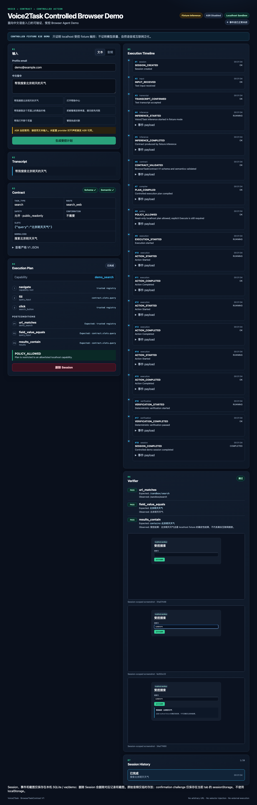
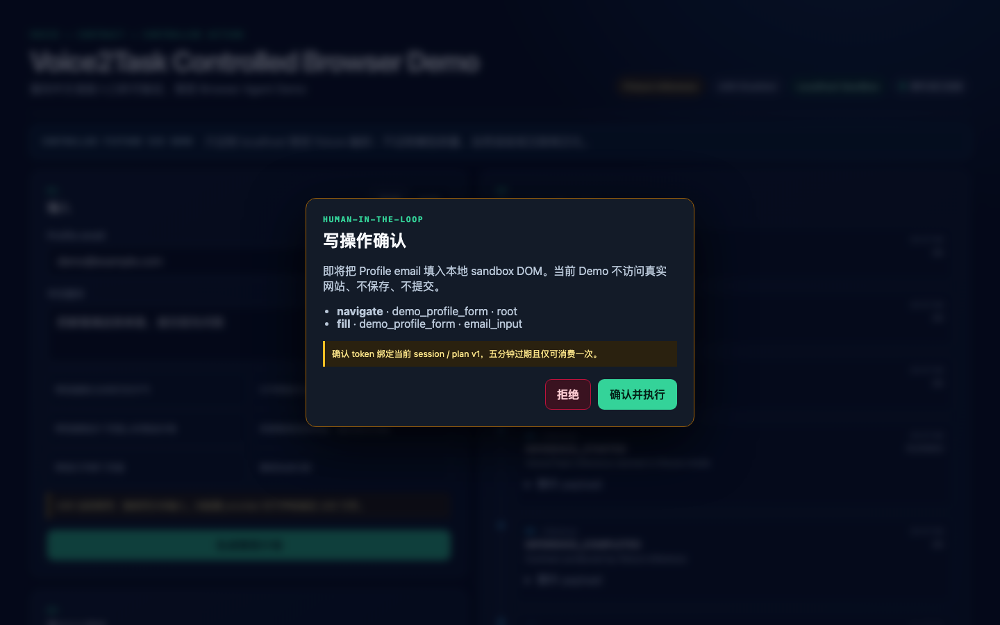

# Voice2Task Post-Training

[中文](README.md) | [English](README_en.md)


Voice2Task 是一个中文 spoken command / ASR transcript 到浏览器任务合约的
post-training 项目。
核心模型任务不是直接控制浏览器，而是把用户口语命令转换成严格的
Browser Task Contract JSON，供后续浏览器 agent 决定搜索、打开 URL、
填写表单、抽取页面信息、澄清或拒绝高风险动作。

## 30 秒理解项目

Voice2Task 有两个证据边界明确分开的 surface：模型后训练负责把中文语音
命令或经人工复核的 ASR transcript 转成严格合约；受控 Demo 负责在
localhost fixture 中编排、执行和验证该合约。

### A. Model / Post-Training Surface

- **模型与数据：** Qwen2.5-7B-Instruct + LoRA；247 seeds、696 SFT rows、
  2,100 preference pairs。
- **Frozen evaluation：** `lockbox-v1` 为 120 rows / 120 semantic
  families，采用 frozen manifest、gold-free prompt 和 one-look aggregate
  evaluation。
- **Final SFT aggregate deltas：** semantic contract validity **+4.17pp**、
  task type accuracy **+6.67pp**、route accuracy **+5.83pp**、
  confirmation accuracy **+8.33pp**。
- **硬边界：** strict contract exact match 从 **0.0167 降至 0.0083**；
  因此本仓库作出 `no overall model improvement claim`。

### B. Controlled Agent Demo Surface

- **全栈：** React / Vite UI、FastAPI API、WebSocket event stream，
  SQLite 是 session / event 的权威状态，Playwright 只执行
  exact-origin localhost sandbox。
- **控制链：** `BrowserTaskContract V1` -> compiler / policy ->
  one-time confirmation challenge -> 独立 explicit execution request ->
  deterministic verifier。
- **Committed controlled result：** expected terminal state + strict contract
  **6/6**；executable verifier **4/4**；Blocked / Clarify no-execution
  verifier **2/2**。
- **默认模式：** `Fixture Inference`、`ASR Disabled`、`Localhost Sandbox`。
  Private model 与 HTTP ASR 只能显式 opt in，并且 fail closed。

## Explicit Non-Claims / 明确非声明

这个高可见边界同时约束模型结果和 Demo 结果。本仓库不作以下声明：

- `no overall model improvement claim`；
- `no real-ASR benchmark claim`；
- `no live-browser benchmark claim`；
- `no production-readiness claim`；
- `no safety-readiness claim`；
- `no generic-agent claim`；
- `no checkpoint / adapter release claim`；
- `no DPO success claim`。

受控 Demo 只证明六条公开 fixture 的 localhost orchestration；它不是
模型质量、真实 ASR、真实互联网泛化或生产能力 benchmark。

## Controlled Demo：真实 committed screenshots

以下图片来自仓库已提交的真实 localhost FastAPI + Chromium 运行结果；
点击图片可查看完整分辨率。没有生成伪造截图或把静态图包装成 GIF。

<table>
  <tr>
    <td align="center" valign="top">
      <a href="docs/demo/screenshots/desktop-search-complete.png">
        
      </a>
    </td>
    <td align="center" valign="top">
      <a href="docs/demo/screenshots/desktop-form-confirmation.png">
        
      </a>
    </td>
  </tr>
  <tr>
    <td valign="top"><strong>Desktop Search complete.</strong> Fixture Inference · ASR Disabled · Localhost Sandbox。受控 Search 编排与确定性 verifier 已完成；<strong>不是</strong> live-internet 或 model-quality benchmark。</td>
    <td valign="top"><strong>Desktop Form confirmation.</strong> Fixture Inference · ASR Disabled · Localhost Sandbox。写操作停在一次性 confirmation challenge，确认与执行分为两个请求；<strong>不是</strong> live-internet 或 model-quality benchmark。</td>
  </tr>
</table>

[Search 原始 committed PNG](docs/demo/screenshots/desktop-search-complete.png) ·
[Form confirmation 原始 committed PNG](docs/demo/screenshots/desktop-form-confirmation.png)

## Architecture at a Glance / 架构速览


```mermaid
flowchart LR
    UI["React / Vite UI"] --> INPUT["Spoken command<br/>or reviewed transcript"]
    ASR["HTTP ASR<br/>opt-in; default disabled"] -. "reviewed transcript" .-> INPUT
    INPUT --> ADAPTER["FastAPI inference adapter<br/>fixture default<br/>private PEFT opt-in"]
    ADAPTER --> CONTRACT["BrowserTaskContract V1"]
    CONTRACT --> POLICY["Compiler / policy"]
    POLICY -->|"write plan"| CHALLENGE["One-time confirmation<br/>challenge"]
    CHALLENGE --> EXECUTE["Explicit execution<br/>request"]
    POLICY -->|"read-only plan"| EXECUTE
    EXECUTE --> PLAYWRIGHT["Playwright exact-origin<br/>localhost sandbox"]
    PLAYWRIGHT --> VERIFY["Deterministic verifier"]
    VERIFY --> EVIDENCE["Event / artifact evidence<br/>SQLite authoritative state<br/>WebSocket stream"]
    ASR -. "failure" .-> CLOSED["Fail closed"]
    ADAPTER -. "private-model failure" .-> CLOSED
    CLOSED --- NOFALLBACK["No failed private-model<br/>fallback to fixture"]
```

Fixture inference 是默认模式；private PEFT model 与 HTTP ASR 都是 opt-in。
任一私有 provider 失败都会 fail closed，绝不静默回退到 fixture。完整信任边界
见 [Demo architecture](docs/demo/architecture.md)。

## 招聘用简历表述

- 基于 **Qwen2.5-7B-Instruct + LoRA** 构建中文语音/ASR 到
  `BrowserTaskContract` 的后训练与 evidence-first 评测流程，整理
  **247 seeds / 696 SFT rows / 2,100 preference pairs**，并在
  **120-row / 120-family frozen lockbox** 上报告 final SFT 的
  semantic validity **+4.17pp**、task type **+6.67pp**、route **+5.83pp**
  与 confirmation **+8.33pp**；同时保留 strict exact
  **0.0167 -> 0.0083** 的负面结果，不宣称 overall model improvement。
- 实现 **React / Vite + FastAPI + WebSocket + SQLite + Playwright** 的
  controlled full-stack Browser Agent Demo，以两阶段确认/执行、
  exact-origin localhost sandbox 和 deterministic verifier 验证
  **6/6** 终态+严格合约、**4/4** 可执行场景、**2/2** Blocked/Clarify
  零执行；结果仅代表 fixture orchestration，不代表模型、真实 ASR、
  互联网泛化或生产能力。

## 运行 Controlled Browser Demo

本仓库包含一个可选的、面向中文语音入口的可验证受控 Browser Agent
Demo：`fixture inference + disabled ASR + localhost sandbox execution`。
它复用 `BrowserTaskContract V1`，通过 `202 Accepted` 后台生命周期、
静态 capability、可恢复的一次性 challenge、两阶段确认/执行、
Playwright exact-origin 隔离和独立 action/DOM evidence 演示六条公开场景。

```bash
python -m pip install -e '.[demo,dev]'
python -m playwright install chromium
make demo
```

[运行说明、架构、截图与严格非声明边界](docs/demo/README.md) · [六场景 benchmark](reports/demo-mvp/summary.md)

该 Demo 只证明受控 fixture 编排，不证明通用 Agent、真实互联网泛化、自然语音/ASR 泛化、模型质量、生产级或已上线。默认不加载私有 adapter，不访问 lockbox，不运行训练。

## Final Lockbox v1 Result

Frozen protocol:
`lockbox_hash=06114cf3ad6029930284af5f2245fb2c4a8174fd35c6a1107f4c73482b555b33`,
prompt policy `unified_gold_free_v1`, greedy decoding,
schema guard + one schema retry, strict evaluator,
two pre-registered arms only.

| Metric | Base Qwen2.5-7B | Final SFT adapter | Delta |
| --- | ---: | ---: | ---: |
| `contract_exact_match` | 0.0167 | 0.0083 | -0.0083 |
| `semantic_contract_valid_rate` | 0.8250 | 0.8667 | +0.0417 |
| `task_type_accuracy` | 0.7917 | 0.8583 | +0.0667 |
| `route_accuracy` | 0.8000 | 0.8583 | +0.0583 |
| `confirmation_accuracy` | 0.7083 | 0.7917 | +0.0833 |
| `strict_schema_valid_rate` | 1.0000 | 0.9833 | -0.0167 |
| `slot_f1` | 0.0417 | 0.0500 | +0.0083 |
| `slot_f1_soft` | 0.3783 | 0.3867 | +0.0084 |

Interpretation:

- Final SFT did **not** improve strict contract exact match on the frozen lockbox.
- Final SFT did improve several semantic/channel metrics:
  `semantic_contract_valid_rate +0.0417`, `task_type_accuracy +0.0667`,
  `route_accuracy +0.0583`, `confirmation_accuracy +0.0833`.
- This is aggregate-only one-look evidence. Public reports do not include row-level failure analysis；不能据此推断 row-level failure cause、natural-ASR generalization 或 overall SFT causal effect。

Evidence links:

- [Final comparison JSON](reports/lockbox-v1/final-evaluation/comparison.json)
- [Final run card](reports/lockbox-v1/final-evaluation/run-card.json)
- [Final comparison Markdown](reports/lockbox-v1/final-evaluation/comparison.md)
- [Current status and evidence](docs/current-status.md)
- [Lockbox protocol](docs/lockbox.md)

## Repository Role

| This repo is | This repo is not |
| --- | --- |
| A speech/ASR-to-contract post-training evidence repository | A generic chat fine-tuning project |
| A strict JSON contract pipeline plus a controlled localhost orchestration demo | A generic/open-world browser controller or GUI action-policy learner |
| A public-safe SFT/DPO data, training, prediction, and evaluation workflow | A checkpoint or adapter release |
| A place where negative, blocked, and superseded evidence stays auditable | A success story built by deleting inconvenient results |

## Method Overview

1. Build public-safe Voice2Task data from seed traces into SFT and preference rows.
2. Render Qwen chat prompts with no gold contract in prediction prompts.
3. Train LoRA SFT adapters on existing training data only.
4. Decode greedily with `max_new_tokens=256`, schema guard enabled, and at most one schema retry.
5. Score with strict layered metrics: JSON parse, strict schema validity,
   semantic contract validity, exact match, slot-level metrics,
   route/task/confirmation/safety metrics.
6. Freeze lockbox rows and manifest before the final one-look evaluation.

## Quick Start

Install local tooling:

```bash
python -m venv .venv
source .venv/bin/activate
pip install -e '.[dev,dataset]'
```

Rebuild and validate the committed public sample:

```bash
PYTHONPATH=src python -m voice2task.cli.data build-public \
  --seed data/public-samples/seed_traces.jsonl \
  --output data/public-samples

PYTHONPATH=src python -m voice2task.cli.data validate \
  --sft data/public-samples/sft_public_sample.jsonl \
  --dpo data/public-samples/dpo_public_sample.jsonl \
  --manifest data/public-samples/manifest_public_sample.json \
  --public

PYTHONPATH=src python -m voice2task.cli.data audit-splits \
  --seed data/public-samples/seed_traces.jsonl \
  --sft data/public-samples/sft_public_sample.jsonl \
  --dpo data/public-samples/dpo_public_sample.jsonl \
  --manifest data/public-samples/manifest_public_sample.json \
  --output reports/public-sample/split-integrity-audit
```

Run local baselines and metrics:

```bash
PYTHONPATH=src python -m voice2task.cli.eval baseline \
  --gold data/public-samples/sft_public_sample.jsonl \
  --output reports/public-sample/rule_baseline_predictions.jsonl

PYTHONPATH=src python -m voice2task.cli.eval metrics \
  --gold data/public-samples/sft_public_sample.jsonl \
  --predictions reports/public-sample/rule_baseline_predictions.jsonl \
  --output reports/public-sample
```

Dry-run training metadata export remains available, but real heavy training is gated by explicit config:

```bash
PYTHONPATH=src python -m voice2task.cli.train sft \
  --config configs/sft-dev.json \
  --manifest data/public-samples/manifest_public_sample.json \
  --output-dir reports/public-sample/sft-dry-run \
  --dry-run

PYTHONPATH=src python -m voice2task.cli.train dpo \
  --config configs/dpo-dev.json \
  --manifest data/public-samples/manifest_public_sample.json \
  --output-dir reports/public-sample/dpo-dry-run \
  --dry-run
```

## Metric Interpretation Boundaries

`contract_exact_match` is a hard full-contract exact-match metric. Future evaluator runs use recursive JSON type-strict equality: booleans, integers, and floating-point values are distinct; object key order and serialization whitespace are ignored; array order is preserved; non-finite or non-JSON values fail closed. Historical metrics were not re-scored.
`normalized_command` string-mismatch diagnostics are explanatory row-level
evidence only: they do not relax, normalize, semantically score, repair, replace,
or re-score predictions, and they do not automatically mark Chinese phrase differences such as `搜索/查询` or `明天的天气/明天天气` as equivalent.

`normalized_command` gold targets are canonical Chinese intent phrases, not
verbatim transcripts or ASR text. This is target-writing guidance for SFT/DPO
data and prompts, not evaluator-side normalization, semantic-equivalence
scoring, prediction repair, or re-scoring.

### Normalized Command Target Policy

Targets use canonical Chinese intent phrases, not verbatim transcripts or ASR
text. Representative forms include `搜索北京明天天气`, `打开示例网站`,
`填写邮箱并确认`, and `拒绝代替用户付款`. This is authoring guidance, not
evaluator-side normalization or semantic-equivalence scoring.

## Evidence Archive

Longer-running internal evidence remains documented below the headline result:

- Public split integrity: the current 282/207/207 dev/test boundary is
  `DEVELOPMENT_ONLY_SPENT`, not blind, independent, leakage-free, or
  final-generalization evidence. The audit preserves historical rows and
  metrics; lockbox-v1 remains the distinct frozen one-look aggregate boundary.
- Contract V2 projection: `PARTIAL_SCHEMA_BENEFIT`; derived-field-only strict
  failures are 14.65%, normalized-command-only strict failures are 14.65%, and
  core slot failures remain 68.79% of V1 strict failures. This is useful
  schema-burden evidence, not model-quality evidence.
- Copy-backed verification and shadow mode: observe-only provenance/interface evidence, not runtime enforcement.
- Copy-shadow template-disjoint challenge v1: adversarial verifier fixture, not a naturalistic language benchmark.
- Earlier step-matched SFT ablations: mixed/inconclusive; no stable broad canonical-slot benefit.

See [current status](docs/current-status.md) and
[public evidence index](reports/public-sample/EVIDENCE_INDEX.md) for the
complete archived map.

## A100 Boundary

GPU-heavy training and prediction are designed for a private A100 development
machine.
Public repo artifacts intentionally omit checkpoints, LoRA adapters, raw logs,
remote caches, private corpus rows, hostnames, SSH details, credentials,
private paths, private override configs, and production-readiness claims.

## Validation

Useful local checks:

```bash
PYTHONPATH=src pytest -q
PYTHONPATH=src ruff check src tests
OPENSPEC_TELEMETRY=0 openspec validate --all --strict
PYTHONPATH=src python scripts/check_current_truth_surface.py
git diff --check
```

## License

本项目采用 [MIT License](LICENSE)。
