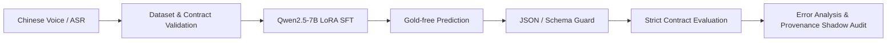

# Voice2Task Post-Training

[中文](README.md) | [English](README_en.md)

中文语音 / ASR 指令到可验证 Browser Task Contract 的大模型后训练与可信评测系统。

基于 Qwen2.5-7B-Instruct + LoRA，覆盖数据构建、assistant-only SFT、
gold-free 推理、严格合约评测、等步数消融与错误归因。

Python · PyTorch · Transformers · TRL · PEFT · Qwen2.5-7B · LoRA

| 247 seeds -> 696 SFT rows | 282 manifest-bound train-only rows | 2100 preference pairs |
| --- | --- | --- |
| 120 rows / 120 families frozen lockbox | 真实私有 A100 bounded smoke | 1485 automated tests |

## 项目价值

Voice2Task 不控制浏览器。它把中文口语命令或 ASR transcript 转换成严格、
机器可校验的 Browser Task Contract，供下游系统决定搜索、打开 URL、
填写表单、抽取页面信息、澄清请求或拒绝高风险动作。

项目的核心不是生成一段“看起来合理”的文本，而是让模型输出可解析、
可做 schema 检查、可逐字段比较并能追溯失败原因的结构化任务合约。

这使后训练目标、推理输出和评测口径落在同一份明确契约上，
同时把浏览器执行、线上自动化与生产部署留在项目边界之外。

## 核心结果

最终结果来自 120 rows / 120 semantic families 的冻结 one-look lockbox。
Base 与 Final SFT 使用预注册 prompt、greedy decode、schema guard 和严格评测器。

| 冻结 lockbox 指标 | Base Qwen2.5-7B | Final SFT | 变化 |
| --- | ---: | ---: | ---: |
| Semantic contract valid rate | 82.50% | 86.67% | **+4.17 pp** |
| Task type accuracy | 79.17% | 85.83% | **+6.67 pp** |
| Route accuracy | 80.00% | 85.83% | **+5.83 pp** |
| Confirmation accuracy | 70.83% | 79.17% | **+8.33 pp** |
| Strict contract exact match | 1.67% | 0.83% | **-0.83 pp** |

Final SFT arm 在 semantic validity、task type、route 与 confirmation 指标上的
聚合得分高于 Base arm，但 strict full-contract exact 得分更低。因此项目不声称
整体模型质量提升，也不把局部指标差异包装成完整合约生成能力已经改善。

权威结果见 [lockbox comparison JSON](reports/lockbox-v1/final-evaluation/comparison.json)；
完整解释与限制见 [current status](docs/current-status.md)。

## 我完成的核心工作

### 1. 数据与后训练流水线

- 基于 Qwen2.5-7B-Instruct + LoRA，使用 PyTorch、Transformers、TRL 与 PEFT
  实现 assistant-only loss 后训练路径；把 247 条 seeds 构建为 696 条 SFT rows
  与 2100 组 preference pairs，并保留严格的数据和合约校验。

- 将 282 条 canonical train-only rows 绑定到正式 manifest 与 SHA-256，避免训练
  输入悄然漂移。真实训练仅接受 ignored private config、本地模型权重和私有 A100；
  adapter/checkpoint 不公开，也不允许运行时下载替代本地模型。

[归档的 public-safe A100 smoke 证据](openspec/changes/archive/2026-07-15-rerun-real-a100-sft-smoke-after-cli-fix-v1/tasks.md)
记录了恰好一次 launch、一个 optimizer step、两条训练 rows；224 个 adapter tensors
中 112 个发生变化且全部有限。它只证明 bounded training path 与参数更新可行。

### 2. 可信评测与实验设计

- 构建 120 rows / 120 families 的冻结 one-look lockbox；固定 gold-free prompt、
  greedy decode、schema guard 与 strict evaluator，分层衡量 JSON、schema、语义、
  路由、确认和 strict full-contract exact。

- 设计 Control/Treatment 等步数消融，每个 arm 固定 3132 optimizer steps，
  明确不是 token matched。实验没有调参评测器、语义放宽、预测修复或选择性报告，
  正向指标与 strict exact 回退同时保留。

### 3. 错误归因与安全边界

- 错误分析显示 68.79% 的 V1 strict failures 集中在 core slots；据此区分
  copy-backed、bounded structured 与 unresolved 表示。实现的
  [observe-only provenance shadow hook](reports/public-sample/copy-backed-prediction-shadow-hook/summary.json)
  默认关闭，不改预测、不参与执行决策。

- [template-disjoint challenge 的已观测结果](reports/public-sample/copy-shadow-template-disjoint-challenge-v1/adapter-evaluation/challenge-evaluation-summary.json)
  记录 3 个 source-absent、6 个 normalization-collision 和 3 个 partial-span
  false-trust。它是 adversarial verifier fixture 证据，不是自然语言 ASR 或模型质量证据。

训练与证据导出还使用 fail-closed GPU/path/data/adapter/public-output gates；
任一模型身份、数据绑定、输出边界或 smoke 后置条件不满足时都会停止。

## 系统流程


```mermaid
flowchart LR
    A["Chinese Voice / ASR"] --> B["Dataset & Contract Validation"]
    B --> C["Qwen2.5-7B LoRA SFT"]
    C --> D["Gold-free Prediction"]
    D --> E["JSON / Schema Guard"]
    E --> F["Strict Contract Evaluation"]
    F --> G["Error Analysis & Provenance Shadow Audit"]
```

流程终点是严格评测与错误审计，不包含浏览器执行、线上部署或生产自动化。

## 为什么结果可信

- 数据切分采用 family-aware 规则，并通过
  [split integrity audit](reports/public-sample/split-integrity-audit/summary.json)
  显式记录跨 split 风险，而不是默认宣称数据天然干净。

- 最终评测使用 120 rows / 120 families 的冻结 one-look lockbox；
  只公开聚合结果，不使用 lockbox 逐行错误做再次调优。

- recursive `JSON type-strict` equality 是未来 evaluator runs 的 exact 边界；
  本页展示的历史 lockbox metrics 未重新计分。 Object key order and serialization
  whitespace 可忽略，数组顺序保留，布尔、整数与浮点数区分，异常值 fail closed。

- step-matched 实验固定 prompt、decoder、schema guard 与 evaluator，
  每个 arm 使用 3132 optimizer steps，并明确披露 not token matched。

- public dev/test 标记为 `DEVELOPMENT_ONLY_SPENT`；它们不是干净独立 held-out。
  页面同时报告局部正向变化和 strict exact 负向结果。

## 仓库导航

| 入口 | 用途 |
| --- | --- |
| [Public manifest](data/public-samples/manifest_public_sample.json) | 247 / 696 / 2100 计数、split 与文件哈希 |
| [Train-only SFT artifact](data/public-samples/sft_train_public_sample.jsonl) | 282 条 manifest-bound canonical train rows |
| [Training CLI](src/voice2task/cli/train.py) | SFT preflight、训练与 gold-free prediction 入口 |
| [Evaluation CLI](src/voice2task/cli/eval.py) | 严格分层评测入口 |
| [Lockbox comparison](reports/lockbox-v1/final-evaluation/comparison.json) | Base 与 Final SFT 冻结聚合结果 |
| [Step-matched ablation](reports/public-sample/step-matched-canonical-slot-ablation/comparison.json) | 3132-step Control/Treatment 对照与边界 |
| [Slot-error summary](reports/public-sample/slot-error-mechanism-analysis/summary.json) | core-slot 瓶颈与表示分析 |
| [Evidence index](reports/public-sample/EVIDENCE_INDEX.md) | CURRENT、HISTORICAL、BLOCKED 等证据地图 |
| [Training spec](openspec/specs/supervised-contract-tuning/spec.md) / [dataset spec](openspec/specs/voice2task-dataset-preparation/spec.md) | 当前 OpenSpec 训练与数据契约 |
| [Tests](tests) | 数据、训练、评测、证据与边界回归测试 |

## 本地验证

以下命令只验证公开仓库，不下载模型，也不启动训练：

```bash
PYTHONPATH=src pytest -q
PYTHONPATH=src ruff check .
OPENSPEC_TELEMETRY=0 openspec validate --all --strict
PYTHONPATH=src python scripts/check_current_truth_surface.py
```

真实训练需要 ignored private config 与本地模型权重；仓库不公开主机、SSH、路径、
token、私有配置、原始日志或 adapter 位置。

## 项目状态

**已完成：Portfolio-ready research and engineering project。**

- 完成公开数据构建、manifest/SHA-256 绑定与 assistant-only LoRA SFT 路径。
- 完成 fail-closed 私有 A100 bounded smoke，证明单步训练和 adapter 参数更新。
- 完成 gold-free 推理、strict evaluator 与冻结 one-look lockbox 聚合评测。
- 完成 3132-step matched A/B、slot-error attribution 与 mixed representation 设计。
- 完成 observe-only provenance shadow audit 与 verifier false-trust challenge。
- 当前自动化基线为 1485 tests；adapter 与 checkpoint 仍为私有且未发布。

**证据边界：**

- Contract V2 离线投影结论是 `PARTIAL_SCHEMA_BENEFIT`，不是模型质量结论。
- derived-field-only strict failures 为 14.65%；这只说明部分 schema burden。
- core slot failures 仍占 68.79%，是完整合约 strict failure 的主要瓶颈。
- public dev/test 状态是 `DEVELOPMENT_ONLY_SPENT`，不构成 clean held-out evidence。
- 后续 exact 采用 `JSON type-strict` 递归比较；历史指标没有重算。
- `strict exact remains canonical`：局部指标不能替代完整合约严格一致性。

### Metric Interpretation Boundaries

`contract_exact_match` is a hard full-contract exact-match metric. Future runs use
recursive `JSON type-strict` equality: object key order and serialization whitespace
are ignored, array order is preserved, and non-finite or non-JSON values fail closed.

`normalized_command` string-mismatch diagnostics are explanatory row-level evidence only.
They do not relax, normalize, semantically score, repair, replace, or re-score predictions.
They do not automatically mark Chinese phrase differences such as `搜索/查询` or
`明天的天气/明天天气` as equivalent.

### Normalized Command Target Policy

Targets use canonical Chinese intent phrases, not verbatim transcripts or ASR text.
Representative forms include `搜索北京明天天气`、`打开示例网站`、`填写邮箱并确认`
和 `拒绝代替用户付款`。 This is authoring guidance only: not evaluator-side normalization,
semantic-equivalence scoring, prediction repair, or rescoring.

**明确不声称：**

- 不声称整体模型质量提升或 final SFT 的总体因果收益。
- 不声称 production readiness 或 safety certification。
- 不声称 live-browser benchmark gain；项目没有控制浏览器。
- 不声称 DPO benefit，也没有以本结果授权 DPO/GRPO。
- 不声称 clean held-out generalization 或 naturalistic ASR generalization。
- 不声称已经发布 checkpoint、adapter 或可复现的私有模型产物。

项目展示的是可审计的数据、后训练、严格评测和负结果处理能力，
不是把一次 bounded smoke 或若干正向 aggregate metrics 包装成上线能力。

## License

本项目采用 [MIT License](LICENSE)。
