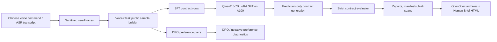

# Voice2Task Post-Training

[中文](README.md) | [English](README_en.md)


Voice2Task Post-Training is an evidence-first fine-tuning project for Chinese voice-to-browser task contracts. It turns Chinese spoken commands or ASR transcripts into safe, evaluable, reproducible browser task contract JSON, then keeps the whole path auditable through SFT/DPO data, 7B LoRA training gates, strict metrics, public-safe evidence packs, and OpenSpec archives.

The core question is intentionally narrow:

> Can a 7B model reliably convert natural Chinese browser intent into executable contract JSON, beyond memorizing the training format?

The current answer is conservative. The Qwen2.5-7B LoRA path runs on the private A100 environment. The latest current evidence is step-matched projection input recovery: the prior Contract V2 projection failed closed because current raw prediction / gold contract artifacts were missing; those public-safe Control/Treatment dev/test predictions and dev/test gold contracts are now recovered and reproduce the committed aggregate metrics. The next action is not another small canonical-candidate loop, DPO, or Contract V2 implementation. It is to rerun the same bounded projection evaluation with the recovered inputs.

## TL;DR

- Input: Chinese voice commands, ASR transcripts, browser task intent.
- Output: strict-schema browser task contract JSON.
- Data: the current formal public sample boundary is `public-sample-20260619T090925Z`, with 247 seeds, 696 SFT rows, and 2100 DPO preference pairs, split as train/dev/test = 282/207/207. The old 77-seed / 231-SFT / 661-DPO boundary is historical.
- Model path: Qwen2.5-7B-Instruct + LoRA. Training and prediction evidence comes from a private A100 runtime; weights and adapters are not committed.
- Latest public evidence: [`step-matched-canonical-slot-ablation/raw-inputs`](reports/public-sample/step-matched-canonical-slot-ablation/raw-inputs/recovery-summary.md) recovers the current step-matched projection inputs; the prior [`contract-v2-projection`](reports/public-sample/contract-v2-projection/decision.md) remains blocked projection evidence.
- Boundary: this repo proves that the data/training/prediction/eval path is real; it does not claim stable canonical-slot benefit, held-out recovery, production readiness, private-corpus generalization, live-browser benchmark gains, or a released checkpoint.

## Current Snapshot

| Item | Status |
| --- | --- |
| Public sample | current: 247 seeds, 696 SFT rows, 2100 DPO pairs; historical: 77 seeds, 231 SFT rows, 661 DPO pairs |
| Public split | current: train 282 / dev 207 / test 207; historical: train 93 / dev 69 / test 69 |
| Base model | Qwen/Qwen2.5-7B-Instruct |
| Adapter state | step-matched Control / Treatment private A100 adapters observed, not released |
| Latest evidence | Step-matched projection input recovery |
| Optimizer-step budget | Control and Treatment both use 3132 optimizer steps |
| Strict exact match | Control dev 0.8357 / test 0.7778; Treatment dev 0.8357 / test 0.7923 |
| Executable pass | Control dev 0.8551 / test 0.8213; Treatment dev 0.8647 / test 0.8164 |
| Projection decision | previous projection remains `PROJECTION_BLOCKED_OR_INVALID`; recovered inputs are `RECOVERED_FROM_EXISTING_ARTIFACTS` |
| Interpretation | mixed / inconclusive source ablation; raw projection inputs are now recovered, but Contract V2 projection metrics have not been rerun |
| Next bounded action | rerun the same bounded projection evaluation with recovered step-matched inputs |

## Positioning

| This repo is | This repo is not |
| --- | --- |
| A speech/ASR-to-contract post-training experiment | A generic chat fine-tuning project |
| A strict JSON contract generation and evaluation pipeline | A GUI action policy or browser controller |
| An auditable SFT/DPO data, training, prediction, and evaluation workflow | A checkpoint or adapter release |
| A repository that separates train memorization from held-out generalization | A success story built on relaxed soft metrics |
| A public-safe evidence map | A dump of private data, SSH details, remote paths, or raw logs |

## Architecture



## What Is Implemented

| Area | Files |
| --- | --- |
| Dataset generation and validation | `src/voice2task/dataset.py`, `src/voice2task/validation.py`, `data/public-samples/` |
| Contract schema and evaluator | `src/voice2task/schemas.py`, `src/voice2task/evaluation.py` |
| SFT/DPO formatting | `src/voice2task/formatting.py`, `src/voice2task/dpo.py` |
| Training and prediction gates | `src/voice2task/training.py`, `configs/` |
| CLI surfaces | `src/voice2task/cli/data.py`, `src/voice2task/cli/train.py`, `src/voice2task/cli/eval.py`, `src/voice2task/cli/report.py` |
| Public-safe evidence | `reports/public-sample/`, `docs/human-briefs/`, `openspec/changes/archive/` |

## 3-Minute Reviewer Path

1. Read the current boundary: [`reports/public-sample/step-matched-canonical-slot-ablation/decision.md`](reports/public-sample/step-matched-canonical-slot-ablation/decision.md).
2. Inspect current dev/test metrics and deltas: [`comparison.json`](reports/public-sample/step-matched-canonical-slot-ablation/comparison.json).
3. Inspect boundary verification: [`boundary-verification.json`](reports/public-sample/step-matched-canonical-slot-ablation/boundary-verification.json).
4. Inspect row/family diagnostics: [`paired-row-analysis.json`](reports/public-sample/step-matched-canonical-slot-ablation/paired-row-analysis.json) and [`family-level-deltas.json`](reports/public-sample/step-matched-canonical-slot-ablation/family-level-deltas.json).
5. Inspect the active OpenSpec change for the blocked projection phase: [`openspec/changes/design-and-evaluate-contract-v2-projection/proposal.md`](openspec/changes/design-and-evaluate-contract-v2-projection/proposal.md).

## Quick Start

Install local tooling:

```bash
python -m venv .venv
source .venv/bin/activate
pip install -e '.[dev,dataset]'
```

Rebuild and validate the committed public sample:

```bash
PYTHONPATH=src python -m voice2task.cli.data build-public \
  --seed data/public-samples/seed_traces.jsonl \
  --output data/public-samples

PYTHONPATH=src python -m voice2task.cli.data validate \
  --sft data/public-samples/sft_public_sample.jsonl \
  --dpo data/public-samples/dpo_public_sample.jsonl \
  --manifest data/public-samples/manifest_public_sample.json \
  --public
```

Run local baselines and metrics:

```bash
PYTHONPATH=src python -m voice2task.cli.eval baseline \
  --gold data/public-samples/sft_public_sample.jsonl \
  --output reports/public-sample/rule_baseline_predictions.jsonl

PYTHONPATH=src python -m voice2task.cli.eval metrics \
  --gold data/public-samples/sft_public_sample.jsonl \
  --predictions reports/public-sample/rule_baseline_predictions.jsonl \
  --output reports/public-sample
```

Run dry-run training metadata export:

```bash
PYTHONPATH=src python -m voice2task.cli.train sft \
  --config configs/sft-dev.json \
  --manifest data/public-samples/manifest_public_sample.json \
  --output-dir reports/public-sample/sft-dry-run \
  --dry-run

PYTHONPATH=src python -m voice2task.cli.train dpo \
  --config configs/dpo-dev.json \
  --manifest data/public-samples/manifest_public_sample.json \
  --output-dir reports/public-sample/dpo-dry-run \
  --dry-run
```

Heavy training is explicitly gated. A real SFT/DPO run requires both `--run-training` and a config with `allow_heavy_training: true`; unresolved template roots keep the run from starting.

## A100 Boundary

GPU-heavy training and prediction are designed for a private A100 development machine. Public repo artifacts intentionally omit:

- checkpoints, LoRA adapters, raw logs, remote caches, and model downloads;
- private corpus rows and full local seed exports;
- hostnames, SSH details, credentials, private paths, and private override configs;
- production-readiness, live-browser benchmark, private-corpus generalization, or checkpoint-release claims.

Prediction-only private runs should write sanitized public-sample outputs and metadata, then commit only aggregate reports, manifests, leak-scan results, and public-safe summaries.

## Evidence Map

| Evidence | What it proves | What it does not prove |
| --- | --- | --- |
| [`step-matched-canonical-slot-ablation/raw-inputs`](reports/public-sample/step-matched-canonical-slot-ablation/raw-inputs/recovery-summary.md) | Current raw-input recovery: original step-matched Control/Treatment dev/test predictions and dev/test gold contracts are public-safe, boundary-verified, and reproduce committed aggregate metrics | Contract V2 projection gain, V2 renderer coverage, Contract V2 implementation readiness, retraining justification |
| [`contract-v2-projection`](reports/public-sample/contract-v2-projection/decision.md) | Prior blocked projection evidence: latest step-matched aggregate artifacts existed, but current raw Control/Treatment dev/test predictions and gold contracts were not yet committed | V2 exact gain, executable gain, renderer coverage, failure-contribution percentages, Contract V2 implementation readiness |
| [`step-matched-canonical-slot-ablation`](reports/public-sample/step-matched-canonical-slot-ablation/decision.md) | Current step-matched Control / Treatment SFT ablation using the same 3132 optimizer-step budget; mixed / inconclusive result with no stable broad canonical-slot benefit | DPO justification, more small-candidate-loop approval, held-out recovery, model recovery, checkpoint release, production readiness |
| [`a100-formal-public-heldout-prediction`](reports/public-sample/a100-formal-public-heldout-prediction/report.md) | Historical formal public manifest prediction-only dev/test evidence: JSON validity 1.0000, strict exact dev 0.3043 / test 0.2899 | Current snapshot, held-out recovery, model recovery, checkpoint release, production readiness |
| [`a100-merged-slot-value-adapter-restore`](reports/public-sample/a100-merged-slot-value-adapter-restore/report.md) | The private 7B adapter prerequisite was available/regenerated on A100 | Model recovery, checkpoint release, public adapter availability |
| [`a100-hardened-canonical-policy-rerun-observed`](reports/public-sample/a100-hardened-canonical-policy-rerun-observed/report.md) | Prediction-only rerun emitted schema-valid public-sample contracts and preserved strict metrics | Held-out recovery, evaluator relaxation, semantic scoring |
| [`a100-merged-slot-value-heldout-eval`](reports/public-sample/a100-merged-slot-value-heldout-eval/report.md) | Earlier merged slot-value adapter evaluation boundary | Production or full private-corpus generalization |
| [`docs/human-briefs/`](docs/human-briefs/) | Human-readable Chinese phase summaries | Source of truth for specs or metrics |
| [`openspec/changes/archive/`](openspec/changes/archive/) | Durable proposal/design/task history | Runtime evidence by itself |

## Metric Interpretation Boundaries

`contract_exact_match` is a hard full-contract exact-match metric. `normalized_command` string-mismatch diagnostics are explanatory row-level evidence only: they do not relax, normalize, semantically score, repair, replace, or re-score predictions, and they do not automatically mark Chinese phrase differences such as `搜索/查询` or `明天的天气/明天天气` as equivalent.

The latest step-matched ablation therefore reads as:

- Control / Treatment used the same 3132 optimizer-step budget;
- dev strict exact did not move, test strict exact improved by 0.0145, but test executable pass declined by 0.0048 and strict slot F1 declined by 0.0032;
- the result is mixed / inconclusive and does not prove stable, general canonical-slot-data benefit;
- the prior attempted projection could not answer the architectural question because the current raw step-matched prediction and gold contracts were not committed; the new raw-input recovery fixes that input gap but has not rerun projection metrics.

## Normalized Command Target Policy

`normalized_command` gold targets are canonical Chinese intent phrases, not verbatim transcripts or ASR text. First-phase public samples use concise target phrases such as `搜索北京明天天气`, `打开示例网站`, `填写邮箱并确认`, and `拒绝代替用户付款`; schema-preserving paraphrases keep the same target contract. This is target-writing guidance for SFT/DPO data and prompts, not evaluator-side normalization, semantic-equivalence scoring, prediction repair, or re-scoring.

## Recommended Next Stage

The next useful action is not another broad rerun, small canonical-candidate loop, DPO, immediate retraining, or Contract V2 implementation. Raw-artifact recovery is now complete under [`raw-inputs`](reports/public-sample/step-matched-canonical-slot-ablation/raw-inputs/recovery-summary.md), so the next bounded stage is projection rerun only:

1. use the recovered public-safe current step-matched Control/Treatment dev/test prediction contracts;
2. use the aligned current dev/test gold contract JSONL files;
3. rerun the same bounded projection evaluation without using older non-step-matched predictions;
4. only then decide whether Contract V2 implementation is justified or whether the slot bottleneck persists.

## Validation

Useful local checks:

```bash
PYTHONPATH=src pytest -q
OPENSPEC_TELEMETRY=0 openspec validate --all --strict
PYTHONPATH=src python -m voice2task.cli.report leak-scan README.md README_en.md reports/public-sample
git diff --check
```

## License

The package metadata declares an MIT license. A standalone `LICENSE` file should be added before presenting the repository as an open-source release.
