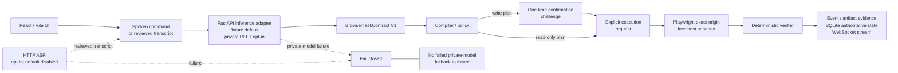

# Voice2Task Post-Training

[中文](README.md) | [English](README_en.md)


Voice2Task is a post-training project for Chinese spoken commands / ASR
transcripts to browser task contracts.
The core model does not directly control a browser.
It converts user commands into strict Browser Task Contract JSON so a downstream
browser agent can decide whether to search, open a URL, fill a form,
extract page information, clarify, or refuse a risky action.

## 30-Second Overview

Voice2Task exposes two deliberately separate evidence surfaces. Model
post-training converts a Chinese spoken command or reviewed ASR transcript into
a strict contract; the controlled demo orchestrates, executes, and verifies that
contract against localhost fixtures.

### A. Model / Post-Training Surface

- **Model and data:** Qwen2.5-7B-Instruct + LoRA; 247 seeds, 696 SFT rows,
  and 2,100 preference pairs.
- **Frozen evaluation:** `lockbox-v1` contains 120 rows / 120 semantic
  families under a frozen manifest, gold-free prompt, and one-look aggregate
  evaluation.
- **Final SFT aggregate deltas:** semantic contract validity **+4.17pp**,
  task type accuracy **+6.67pp**, route accuracy **+5.83pp**, and
  confirmation accuracy **+8.33pp**.
- **Hard boundary:** strict contract exact match fell from **0.0167 to
  0.0083**; therefore this repository makes `no overall model improvement
  claim`.

### B. Controlled Agent Demo Surface

- **Full stack:** React / Vite UI, FastAPI API, WebSocket event stream,
  SQLite-authoritative session/event state, and a Playwright exact-origin
  localhost sandbox.
- **Control chain:** `BrowserTaskContract V1` -> compiler / policy ->
  one-time confirmation challenge -> separate explicit execution request ->
  deterministic verifier.
- **Committed controlled result:** expected terminal state + strict contract
  **6/6**; executable verifier **4/4**; Blocked / Clarify no-execution
  verifier **2/2**.
- **Defaults:** `Fixture Inference`, `ASR Disabled`, and `Localhost Sandbox`.
  The private model and HTTP ASR are explicit opt-ins and fail closed.

## Explicit Non-Claims

This high-visibility boundary applies to both the model result and the demo
result. The repository makes:

- `no overall model improvement claim`;
- `no real-ASR benchmark claim`;
- `no live-browser benchmark claim`;
- `no production-readiness claim`;
- `no safety-readiness claim`;
- `no generic-agent claim`;
- `no checkpoint / adapter release claim`;
- `no DPO success claim`.

The controlled demo proves localhost orchestration for six public fixtures only.
It is not a model-quality, real-ASR, live-internet-generalization, or
production-capability benchmark.

## Controlled Demo: Real Committed Screenshots

These images come from committed localhost FastAPI + Chromium runs. Click either
image for its full resolution. No fabricated image or synthetic GIF is used.

<table>
  <tr>
    <td align="center" valign="top">
      <a href="docs/demo/screenshots/desktop-search-complete.png">
        
      </a>
    </td>
    <td align="center" valign="top">
      <a href="docs/demo/screenshots/desktop-form-confirmation.png">
        
      </a>
    </td>
  </tr>
  <tr>
    <td valign="top"><strong>Desktop Search complete.</strong> Fixture Inference · ASR Disabled · Localhost Sandbox. Controlled Search orchestration and deterministic verification completed; <strong>not</strong> a live-internet or model-quality benchmark.</td>
    <td valign="top"><strong>Desktop Form confirmation.</strong> Fixture Inference · ASR Disabled · Localhost Sandbox. The write pauses at a one-time confirmation challenge, with confirmation and execution split into separate requests; <strong>not</strong> a live-internet or model-quality benchmark.</td>
  </tr>
</table>

[Original committed Search PNG](docs/demo/screenshots/desktop-search-complete.png) ·
[Original committed Form confirmation PNG](docs/demo/screenshots/desktop-form-confirmation.png)

## Architecture at a Glance


```mermaid
flowchart LR
    UI["React / Vite UI"] --> INPUT["Spoken command<br/>or reviewed transcript"]
    ASR["HTTP ASR<br/>opt-in; default disabled"] -. "reviewed transcript" .-> INPUT
    INPUT --> ADAPTER["FastAPI inference adapter<br/>fixture default<br/>private PEFT opt-in"]
    ADAPTER --> CONTRACT["BrowserTaskContract V1"]
    CONTRACT --> POLICY["Compiler / policy"]
    POLICY -->|"write plan"| CHALLENGE["One-time confirmation<br/>challenge"]
    CHALLENGE --> EXECUTE["Explicit execution<br/>request"]
    POLICY -->|"read-only plan"| EXECUTE
    EXECUTE --> PLAYWRIGHT["Playwright exact-origin<br/>localhost sandbox"]
    PLAYWRIGHT --> VERIFY["Deterministic verifier"]
    VERIFY --> EVIDENCE["Event / artifact evidence<br/>SQLite authoritative state<br/>WebSocket stream"]
    ASR -. "failure" .-> CLOSED["Fail closed"]
    ADAPTER -. "private-model failure" .-> CLOSED
    CLOSED --- NOFALLBACK["No failed private-model<br/>fallback to fixture"]
```

Fixture inference is the default. The private PEFT model and HTTP ASR are both
opt-in. Any private-provider failure fails closed and never silently falls back
to fixture inference. See the full [demo architecture](docs/demo/architecture.md).

## Recruiter Resume Bullets

- Built an evidence-first Chinese speech/ASR-to-`BrowserTaskContract`
  post-training pipeline with **Qwen2.5-7B-Instruct + LoRA**, **247 seeds /
  696 SFT rows / 2,100 preference pairs**, and a **120-row / 120-family frozen
  lockbox**; reported final-SFT gains of semantic validity **+4.17pp**, task
  type **+6.67pp**, route **+5.83pp**, and confirmation **+8.33pp**, while
  preserving the negative strict-exact result **0.0167 -> 0.0083** and making
  no overall model-improvement claim.
- Implemented a controlled full-stack Browser Agent Demo with **React / Vite +
  FastAPI + WebSocket + SQLite + Playwright**, two-stage confirmation/execution,
  an exact-origin localhost sandbox, and deterministic verification; validated
  **6/6** terminal+strict-contract outcomes, **4/4** executable scenarios, and
  **2/2** Blocked/Clarify no-execution scenarios, scoped strictly to fixture
  orchestration rather than model, real-ASR, internet, or production capability.

## Run the Controlled Browser Demo

The repository includes an optional, verifiable controlled Browser Agent demo
for a Chinese voice entry point:
`fixture inference + disabled ASR + localhost sandbox execution`. It reuses
`BrowserTaskContract V1` and demonstrates six public scenarios through a
`202 Accepted` background lifecycle, static capabilities, a recoverable
one-time challenge, separate confirm/execute steps, Playwright exact-origin
isolation, and independent action/DOM evidence.

```bash
python -m pip install -e '.[demo,dev]'
python -m playwright install chromium
make demo
```

[Run guide, architecture, screenshots, and strict non-claims](docs/demo/README.md) · [Six-scenario benchmark](reports/demo-mvp/summary.md)

The demo proves controlled fixture orchestration only. It does not establish a general agent, real-internet generalization, natural speech/ASR generalization, model quality, production readiness, deployment, or launch status. It does not load a private adapter, access the lockbox, or train by default.

## Final Lockbox v1 Result

Frozen protocol:
`lockbox_hash=06114cf3ad6029930284af5f2245fb2c4a8174fd35c6a1107f4c73482b555b33`,
prompt policy `unified_gold_free_v1`, greedy decoding,
schema guard + one schema retry, strict evaluator,
and exactly two pre-registered arms.

| Metric | Base Qwen2.5-7B | Final SFT adapter | Delta |
| --- | ---: | ---: | ---: |
| `contract_exact_match` | 0.0167 | 0.0083 | -0.0083 |
| `semantic_contract_valid_rate` | 0.8250 | 0.8667 | +0.0417 |
| `task_type_accuracy` | 0.7917 | 0.8583 | +0.0667 |
| `route_accuracy` | 0.8000 | 0.8583 | +0.0583 |
| `confirmation_accuracy` | 0.7083 | 0.7917 | +0.0833 |
| `strict_schema_valid_rate` | 1.0000 | 0.9833 | -0.0167 |
| `slot_f1` | 0.0417 | 0.0500 | +0.0083 |
| `slot_f1_soft` | 0.3783 | 0.3867 | +0.0084 |

Interpretation:

- Final SFT did **not** improve strict contract exact match on the frozen lockbox.
- Final SFT improved several semantic/channel metrics:
  `semantic_contract_valid_rate +0.0417`, `task_type_accuracy +0.0667`,
  `route_accuracy +0.0583`, `confirmation_accuracy +0.0833`.
- This is aggregate-only one-look evidence. Public reports do not include row-level failure analysis, and it cannot establish row-level failure causes, natural-ASR generalization, or an overall SFT causal effect.

Evidence links:

- [Final comparison JSON](reports/lockbox-v1/final-evaluation/comparison.json)
- [Final run card](reports/lockbox-v1/final-evaluation/run-card.json)
- [Final comparison Markdown](reports/lockbox-v1/final-evaluation/comparison.md)
- [Current status and evidence](docs/current-status.md)
- [Lockbox protocol](docs/lockbox.md)

## Repository Role

| This repo is | This repo is not |
| --- | --- |
| A speech/ASR-to-contract post-training evidence repository | A generic chat fine-tuning project |
| A strict JSON contract pipeline plus a controlled localhost orchestration demo | A generic/open-world browser controller or GUI action-policy learner |
| A public-safe SFT/DPO data, training, prediction, and evaluation workflow | A checkpoint or adapter release |
| A place where negative, blocked, and superseded evidence stays auditable | A success story built by deleting inconvenient results |

## Method Overview

1. Build public-safe Voice2Task data from seed traces into SFT and preference rows.
2. Render Qwen chat prompts with no gold contract in prediction prompts.
3. Train LoRA SFT adapters on existing training data only.
4. Decode greedily with `max_new_tokens=256`, schema guard enabled, and at most one schema retry.
5. Score with strict layered metrics: JSON parse, strict schema validity,
   semantic contract validity, exact match, slot-level metrics,
   route/task/confirmation/safety metrics.
6. Freeze lockbox rows and manifest before the final one-look evaluation.

## Quick Start

Install local tooling:

```bash
python -m venv .venv
source .venv/bin/activate
pip install -e '.[dev,dataset]'
```

Rebuild and validate the committed public sample:

```bash
PYTHONPATH=src python -m voice2task.cli.data build-public \
  --seed data/public-samples/seed_traces.jsonl \
  --output data/public-samples

PYTHONPATH=src python -m voice2task.cli.data validate \
  --sft data/public-samples/sft_public_sample.jsonl \
  --dpo data/public-samples/dpo_public_sample.jsonl \
  --manifest data/public-samples/manifest_public_sample.json \
  --public

PYTHONPATH=src python -m voice2task.cli.data audit-splits \
  --seed data/public-samples/seed_traces.jsonl \
  --sft data/public-samples/sft_public_sample.jsonl \
  --dpo data/public-samples/dpo_public_sample.jsonl \
  --manifest data/public-samples/manifest_public_sample.json \
  --output reports/public-sample/split-integrity-audit
```

Run local baselines and metrics:

```bash
PYTHONPATH=src python -m voice2task.cli.eval baseline \
  --gold data/public-samples/sft_public_sample.jsonl \
  --output reports/public-sample/rule_baseline_predictions.jsonl

PYTHONPATH=src python -m voice2task.cli.eval metrics \
  --gold data/public-samples/sft_public_sample.jsonl \
  --predictions reports/public-sample/rule_baseline_predictions.jsonl \
  --output reports/public-sample
```

Dry-run training metadata export remains available, but real heavy training is gated by explicit config:

```bash
PYTHONPATH=src python -m voice2task.cli.train sft \
  --config configs/sft-dev.json \
  --manifest data/public-samples/manifest_public_sample.json \
  --output-dir reports/public-sample/sft-dry-run \
  --dry-run

PYTHONPATH=src python -m voice2task.cli.train dpo \
  --config configs/dpo-dev.json \
  --manifest data/public-samples/manifest_public_sample.json \
  --output-dir reports/public-sample/dpo-dry-run \
  --dry-run
```

## Metric Interpretation Boundaries

`contract_exact_match` is a hard full-contract exact-match metric. Future evaluator runs use recursive JSON type-strict equality: booleans, integers, and floating-point values are distinct; object key order and serialization whitespace are ignored; array order is preserved; non-finite or non-JSON values fail closed. Historical metrics were not re-scored.
`normalized_command` string-mismatch diagnostics are explanatory row-level
evidence only: they do not relax, normalize, semantically score, repair, replace,
or re-score predictions, and they do not automatically mark Chinese phrase
differences such as `搜索/查询` or `明天的天气/明天天气` as equivalent.

`normalized_command` gold targets are canonical Chinese intent phrases, not
verbatim transcripts or ASR text. This is target-writing guidance for SFT/DPO
data and prompts, not evaluator-side normalization, semantic-equivalence
scoring, prediction repair, or re-scoring.

### Normalized Command Target Policy

Targets use canonical Chinese intent phrases, not verbatim transcripts or ASR
text. Representative forms include `搜索北京明天天气`, `打开示例网站`,
`填写邮箱并确认`, and `拒绝代替用户付款`. This is authoring guidance, not
evaluator-side normalization or semantic-equivalence scoring.

## Evidence Archive

Longer-running internal evidence remains documented below the headline result:

- Public split integrity: the current 282/207/207 dev/test boundary is
  `DEVELOPMENT_ONLY_SPENT`, not blind, independent, leakage-free, or
  final-generalization evidence. The audit preserves historical rows and
  metrics; lockbox-v1 remains the distinct frozen one-look aggregate boundary.
- Contract V2 projection: `PARTIAL_SCHEMA_BENEFIT`; derived-field-only strict
  failures are 14.65%, normalized-command-only strict failures are 14.65%, and
  core slot failures remain 68.79% of V1 strict failures. This is useful
  schema-burden evidence, not model-quality evidence.
- Copy-backed verification and shadow mode: observe-only provenance/interface evidence, not runtime enforcement.
- Copy-shadow template-disjoint challenge v1: adversarial verifier fixture, not a naturalistic language benchmark.
- Earlier step-matched SFT ablations: mixed/inconclusive; no stable broad canonical-slot benefit.

See [current status](docs/current-status.md) and the
[public evidence index](reports/public-sample/EVIDENCE_INDEX.md) for the
complete archived map.

## A100 Boundary

GPU-heavy training and prediction are designed for a private A100 development
machine.
Public repo artifacts intentionally omit checkpoints, LoRA adapters, raw logs,
remote caches, private corpus rows, hostnames, SSH details, credentials,
private paths, private override configs, and production-readiness claims.

## Validation

Useful local checks:

```bash
PYTHONPATH=src pytest -q
PYTHONPATH=src ruff check src tests
OPENSPEC_TELEMETRY=0 openspec validate --all --strict
PYTHONPATH=src python scripts/check_current_truth_surface.py
git diff --check
```

## License

This project is licensed under the [MIT License](LICENSE).
