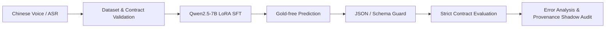

# Voice2Task Post-Training

[中文](README.md) | [English](README_en.md)

A post-training and trustworthy-evaluation system that maps Chinese voice / ASR
instructions to verifiable Browser Task Contracts.

Built on Qwen2.5-7B-Instruct + LoRA, the project covers data construction,
assistant-only SFT, gold-free inference, strict evaluation, step-matched
ablation, and error attribution.

Python · PyTorch · Transformers · TRL · PEFT · Qwen2.5-7B · LoRA

| 247 seeds -> 696 SFT rows | 282 manifest-bound train-only rows | 2100 preference pairs |
| --- | --- | --- |
| 120 rows / 120 families frozen lockbox | Private, bounded real A100 smoke run | 1485 automated tests |

## Project Value

Voice2Task does not control a browser. It converts Chinese spoken commands or
ASR transcripts into strict, machine-verifiable Browser Task Contracts so a
downstream system can decide whether to search, open a URL, fill a form, extract
page information, clarify a request, or refuse a high-risk action.

The goal is not to generate text that merely looks plausible. Model output must
be parseable, schema-checkable, comparable field by field, and traceable when a
failure occurs.

This places post-training targets, inference outputs, and evaluation criteria
under one explicit contract while keeping browser execution, online automation,
and production deployment outside the project boundary.

## Key Results

The final result comes from a frozen one-look lockbox with 120 rows across 120
semantic families. Base and Final SFT used the preregistered prompt, greedy
decode, schema guard, and strict evaluator.

| Frozen lockbox metric | Base Qwen2.5-7B | Final SFT | Change |
| --- | ---: | ---: | ---: |
| Semantic contract valid rate | 82.50% | 86.67% | **+4.17 pp** |
| Task type accuracy | 79.17% | 85.83% | **+6.67 pp** |
| Route accuracy | 80.00% | 85.83% | **+5.83 pp** |
| Confirmation accuracy | 70.83% | 79.17% | **+8.33 pp** |
| Strict contract exact match | 1.67% | 0.83% | **-0.83 pp** |

The Final SFT arm scored higher on semantic validity, task type, routing, and confirmation accuracy, but lower on strict full-contract exact match; the project therefore makes no overall model-quality improvement claim.

See the authoritative [lockbox comparison JSON](reports/lockbox-v1/final-evaluation/comparison.json)
and the full interpretation and limitations in [current status](docs/current-status.md).

## What I Built

### 1. Data and Post-Training Pipeline

- Implemented a Qwen2.5-7B-Instruct + LoRA post-training path with PyTorch,
  Transformers, TRL, PEFT, and assistant-only loss. The data pipeline expands
  247 seeds into 696 SFT rows and 2100 preference pairs while retaining strict
  data and contract validation.

- Bound 282 canonical train-only rows to the formal manifest and SHA-256 so
  training inputs cannot drift silently. Real training runs only with an ignored
  private config, local model weights, and an explicitly selected private A100;
  runtime downloads do not replace the local model. The adapter and checkpoint are private.

The archived [public-safe A100 smoke evidence](openspec/changes/archive/2026-07-15-rerun-real-a100-sft-smoke-after-cli-fix-v1/tasks.md)
records exactly one launch, one optimizer step, and two training rows. Of 224
adapter tensors, 112 changed and all were finite. This proves only that the
bounded training path ran and updated parameters.

### 2. Trustworthy Evaluation and Experimental Design

- Built a frozen one-look lockbox with 120 rows across 120 families. The fixed
  protocol uses a gold-free prompt, greedy decode, schema guard, and strict
  evaluator to measure JSON, schema, semantics, routing, confirmation, and
  strict full-contract exact match separately.

- Designed a step-matched Control/Treatment ablation with exactly 3132 optimizer
  steps per arm; the experiment is explicitly not token matched. It did not tune
  the evaluator, relax semantic rules, repair predictions, or selectively report
  only favorable metrics. Positive metrics and the strict-exact regression remain visible.

### 3. Error Attribution and Safety Boundaries

- Error analysis found that 68.79% of V1 strict failures were concentrated in
  core slots. This motivated separate copy-backed, bounded structured, and
  unresolved representations. The implemented
  [observe-only provenance shadow hook](reports/public-sample/copy-backed-prediction-shadow-hook/summary.json)
  is disabled by default, does not alter predictions, and does not participate
  in execution decisions.

- The observed [template-disjoint challenge result](reports/public-sample/copy-shadow-template-disjoint-challenge-v1/adapter-evaluation/challenge-evaluation-summary.json)
  records 3 source-absent, 6 normalization-collision, and 3 partial-span
  false-trust cases. It is an adversarial verifier fixture, not naturalistic ASR
  or model-quality evidence.

Training and evidence export also use fail-closed GPU, path, data, adapter, and
public-output gates. The process stops when model identity, data binding, output
boundaries, or smoke postconditions do not match the declared contract.

## System Overview


```mermaid
flowchart LR
    A["Chinese Voice / ASR"] --> B["Dataset & Contract Validation"]
    B --> C["Qwen2.5-7B LoRA SFT"]
    C --> D["Gold-free Prediction"]
    D --> E["JSON / Schema Guard"]
    E --> F["Strict Contract Evaluation"]
    F --> G["Error Analysis & Provenance Shadow Audit"]
```

The workflow ends with strict evaluation and error auditing. It contains no
browser execution, online deployment, or production automation stage.

## Why the Results Are Credible

- Data splits follow family-aware rules. The
  [split integrity audit](reports/public-sample/split-integrity-audit/summary.json)
  records cross-split risks explicitly instead of assuming the data is clean.

- Final evaluation uses the frozen one-look lockbox of 120 rows / 120 families.
  Only aggregate results are public; lockbox row-level errors were not used for
  another tuning pass.

- Recursive `JSON type-strict` equality is the exact-match boundary for future
  evaluator runs; the historical lockbox metrics displayed here were not re-scored.
  Object key order and serialization whitespace are ignored, array order is preserved,
  booleans, integers, and floats remain distinct, and non-finite or non-JSON values fail closed.

- The step-matched experiment fixes the prompt, decoder, schema guard, and
  evaluator, with 3132 optimizer steps per arm, and explicitly states that token
  counts were not matched.

- Public dev/test is marked `DEVELOPMENT_ONLY_SPENT`, not clean independent
  held-out evidence. Both positive metric changes and the negative strict-exact
  result are reported.

## Repository Map

| Entry | Purpose |
| --- | --- |
| [Public manifest](data/public-samples/manifest_public_sample.json) | Counts for 247 / 696 / 2100, splits, and file hashes |
| [Train-only SFT artifact](data/public-samples/sft_train_public_sample.jsonl) | 282 manifest-bound canonical training rows |
| [Training CLI](src/voice2task/cli/train.py) | SFT preflight, training, and gold-free prediction entry point |
| [Evaluation CLI](src/voice2task/cli/eval.py) | Strict layered evaluation entry point |
| [Lockbox comparison](reports/lockbox-v1/final-evaluation/comparison.json) | Frozen Base and Final SFT aggregate results |
| [Step-matched ablation](reports/public-sample/step-matched-canonical-slot-ablation/comparison.json) | 3132-step Control/Treatment comparison and boundaries |
| [Slot-error summary](reports/public-sample/slot-error-mechanism-analysis/summary.json) | Core-slot bottleneck and representation analysis |
| [Evidence index](reports/public-sample/EVIDENCE_INDEX.md) | Evidence map for CURRENT, HISTORICAL, BLOCKED, and related states |
| [Training spec](openspec/specs/supervised-contract-tuning/spec.md) / [dataset spec](openspec/specs/voice2task-dataset-preparation/spec.md) | Current OpenSpec training and data contracts |
| [Tests](tests) | Regression coverage for data, training, evaluation, evidence, and boundaries |

## Local Verification

These commands validate the public repository only. They do not download a model
or start training.

```bash
PYTHONPATH=src pytest -q
PYTHONPATH=src ruff check .
OPENSPEC_TELEMETRY=0 openspec validate --all --strict
PYTHONPATH=src python scripts/check_current_truth_surface.py
```

Real training requires an ignored private config and local model weights. No
private values, host details, SSH details, private runtime paths, tokens, raw logs,
or adapter locations are published.

## Project Status

**Completed: Portfolio-ready research and engineering project.**

- Completed public data construction, manifest/SHA-256 binding, and the
  assistant-only LoRA SFT path.
- Completed a fail-closed private A100 bounded smoke that demonstrates a
  single-step training path and adapter parameter update.
- Completed gold-free inference, the strict evaluator, and frozen one-look
  lockbox aggregate evaluation.
- Completed the 3132-step-matched A/B experiment, slot-error attribution, and
  mixed-representation design.
- Completed the observe-only provenance shadow audit and verifier false-trust challenge.
- The current automated baseline is 1485 tests; the adapter and checkpoint
  remain private and unreleased.

**Evidence boundaries:**

- The Contract V2 offline projection is `PARTIAL_SCHEMA_BENEFIT`, not a model-quality conclusion.
- Derived-field-only strict failures are 14.65%; this measures only part of the schema burden.
- Core-slot failures remain 68.79%, the main bottleneck in full-contract strict failures.
- Public dev/test is `DEVELOPMENT_ONLY_SPENT`, not clean held-out evidence.
- Future exact comparison uses `JSON type-strict`; historical metrics were not recomputed.
- `strict exact remains canonical`: local metrics cannot replace strict full-contract agreement.

### Metric Interpretation Boundaries

`contract_exact_match` is a hard full-contract exact-match metric. Future runs
use recursive `JSON type-strict` equality: object key order and serialization whitespace
are ignored, array order is preserved, and non-finite or non-JSON values fail closed.

`normalized_command` string-mismatch diagnostics are explanatory row-level evidence only.
They do not relax, normalize, semantically score, repair, replace, or re-score predictions.
They do not automatically mark Chinese phrase differences such as `搜索/查询` or
`明天的天气/明天天气` as equivalent.

### Normalized Command Target Policy

Targets use canonical Chinese intent phrases, not verbatim transcripts or ASR text.
Representative forms include `搜索北京明天天气`, `打开示例网站`, `填写邮箱并确认`,
and `拒绝代替用户付款`. This is target-authoring guidance only, not evaluator-side
normalization, semantic-equivalence scoring, prediction repair, or re-scoring.

**Explicit non-claims:**

- No overall model improvement or overall causal benefit from Final SFT.
- No production readiness or safety certification.
- No live-browser benchmark gain; the project does not control a browser.
- No DPO benefit, and these results do not authorize DPO or GRPO.
- No clean held-out generalization or naturalistic ASR generalization.
- No released checkpoint, adapter, or reproducible private model artifact.

The project demonstrates auditable data, post-training, strict evaluation, and
responsible handling of negative results. It does not present a bounded smoke or
several positive aggregate metrics as production capability.

## License

This project is licensed under the [MIT License](LICENSE).
