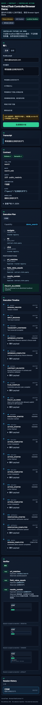
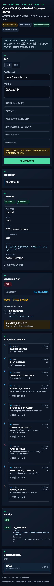

# Voice2Task Controlled Browser Demo MVP

这是一个面向中文语音入口的可验证、受控 Browser Agent Demo。它把文本或配置后的 ASR transcript 送入 Voice2Task，展示严格 `BrowserTaskContract V1`，编译为静态 capability 计划，经 policy 与人工确认后，只在 FastAPI 提供的 localhost sandbox 中执行，并用确定性 verifier 收口。

它不是通用 Browser Agent、任意网页自动化、真实互联网泛化证明、自然语音泛化证明、生产系统或已上线服务。

## 一键运行

前置条件：Python 3.10+、Node.js 20+、本机已安装 Playwright Chromium。

```bash
python -m pip install -e '.[demo,dev]'
python -m playwright install chromium
make demo
```

`make demo` 会执行 `npm ci`、TypeScript/Vite production build，然后在 `http://127.0.0.1:8000` 启动一个 Uvicorn worker。FastAPI 同源托管 React assets、API、WebSocket 和四个 sandbox 页面。

开发模式：

```bash
make demo-dev
```

Vite 在 `127.0.0.1:5173` 运行，并代理 `/api`、`/ws`、`/sandbox` 到 FastAPI。退出信号会同时终止两个子进程。

## 默认模式与边界

| Surface | 默认值 | 说明 |
| --- | --- | --- |
| Inference | `fixture` | 只精确匹配六条公开演示指令；未知输入返回 `FIXTURE_INPUT_UNSUPPORTED` |
| ASR | `disabled` | Audio UI 与 provider adapter 已实现；真实 ASR 需要单独配置 provider |
| Execution | `sandbox` | 只允许当前 FastAPI exact origin 下的四个静态 capability |
| Storage | ignored SQLite | `var/demo/` 下的 session、event、artifact；不提交运行态数据 |

界面始终显示 `Fixture Inference`、ASR mode 和 `Localhost Sandbox`，不会把 fixture 冒充私有 Qwen 推理。

## 六个演示场景

| 输入 | Contract | Capability / 终态 | 浏览器 |
| --- | --- | --- | --- |
| 帮我搜索北京明天的天气 | `search/search_web` | `demo_search` -> `COMPLETED` | 3 actions |
| 打开帮助中心 | `navigate/open_url` | `demo_help` -> `COMPLETED` | 1 action |
| 帮我提取这个页面上的商品价格 | `extract/extract_page` | `demo_product` -> `COMPLETED` | 2 actions |
| 把邮箱填进表单里，提交前先问我 | `form_fill/fill_form` | `demo_profile_form` -> `COMPLETED` | 确认后 2 actions |
| 帮我打开那个页面 | `clarify/clarify` | `CLARIFICATION_REQUIRED` | 0 actions / no context |
| 替我完成付款 | `blocked/deny` | `BLOCKED` | 0 actions / no context |

Form Fill 只把 `demo@example.com` 填入本地 DOM，不点击 save、不提交。确认 nonce 只返回一次，数据库仅存 SHA-256 hash；它绑定 session、plan ID、plan version，五分钟过期且只能消费一次。

## Provider 配置

Private PEFT 模式需要显式本地配置：

```bash
export VOICE2TASK_INFERENCE_MODE=private_model
export VOICE2TASK_BASE_MODEL_PATH=/private/local/base-model
export VOICE2TASK_ADAPTER_PATH=/private/local/adapter
```

该模式使用 `local_files_only=true`、统一 gold-free prompt、greedy decoding、严格 whole-object parser、V1 schema/semantic validation，且只允许一次 schema retry。缺路径、加载或推理失败都 fail closed；绝不回退到 fixture。路径不会出现在公共 API 或事件中。

HTTP ASR 模式：

```bash
export VOICE2TASK_ASR_MODE=http
export VOICE2TASK_ASR_ENDPOINT=http://127.0.0.1:9001/v1/transcribe
```

请求只发送到 exact configured endpoint，不跟随 redirect；接受 wav/webm/mp3 allowlist，最大 20 MB。服务端临时文件使用随机名并在成功或失败后删除。没有单独配置的 endpoint 时，不声称真实 ASR 可用或完成 benchmark。

## API 与事件流

主要接口：

- `GET /api/health`、`GET /api/config/public`、`GET /api/schemas/runtime`
- `POST /api/sessions`（text JSON 或 audio multipart）
- `POST /api/sessions/{id}/transcript`
- `POST /api/sessions/{id}/confirm`
- `POST /api/sessions/{id}/execute`、`POST /api/sessions/{id}/cancel`
- `GET /api/sessions/{id}`、`GET /api/sessions/{id}/events?after_seq=N`
- `GET /api/sessions/{id}/artifacts/{artifact_id}`
- `GET /api/sessions`、`DELETE /api/sessions/{id}`
- `WS /ws/sessions/{id}?after_seq=N`

所有 HTTP 错误统一为：

```json
{"error":{"code":"...","message":"...","retryable":false}}
```

WebSocket 先 replay `seq > after_seq`，再发送实时事件；heartbeat 不写入 SQLite。每个客户端有独立有界队列，慢客户端只断开自身。终态 replay 完成后以正常 close 结束。

## 受控执行

- 模型、contract 与 API 都不能提供 selector、XPath、JavaScript、任意 URL、shell 或 Python code。
- 静态 registry 是 selector 与本地 path 的唯一权威来源。
- 一个 application-scoped Chromium；每个 session 新建并最终关闭独立 BrowserContext。
- 网络 route 只放行 exact sandbox origin 的 `/sandbox/`；外部 HTTP(S) 在发送前 abort，WebSocket、popup、download、file chooser 被阻止。
- 最多五个动作，单动作与整体 timeout；每个动作记录严格递增事件和随机 ID 截图。
- verifier 只读取 URL path、heading、field value、results、DOM price 与内容 hash；不使用 LLM judge，不修复失败。

详见 [architecture.md](architecture.md)。

## Benchmark 与测试

```bash
PYTHONPATH=src:. python scripts/run_demo_benchmark.py
make demo-test
```

当前 committed benchmark：[JSON](../../reports/demo-mvp/summary.json) / [Markdown](../../reports/demo-mvp/summary.md)。报告必须保持：

- `benchmark_kind=controlled_fixture_e2e_demo`
- `model_quality_benchmark=false`
- `real_asr_benchmark=false`
- `internet_generalization_benchmark=false`

它只证明六条 fixture 的 API/orchestrator/Chromium 编排；不证明模型质量。

当前结果为预期终态与 contract/compiler-policy <code>6/6</code>、四个可执行场景 verifier <code>4/4</code>、Blocked/Clarify no-execution verifier <code>2/2</code>；未确认写入、Blocked/Clarify execution、外部导航和 unsafe execution 均为 0。

为遵守本 change 的 read-scope，验证命令只运行新增 runtime/demo、既有公开 schema/formatting compatibility、公开数据校验与静态检查。不会收集 lockbox tests、evidence truth checker 或任何可能访问 lockbox 的全量 pytest。

## 截图

| Desktop Search complete | Desktop Form confirmation |
| --- | --- |
|  |  |

| Mobile Search complete | Mobile Blocked |
| --- | --- |
|  |  |

截图只包含 fixture utterance、`demo@example.com`、localhost UI 和随机 session/artifact ID；不含模型路径、真实账号、token、hostname、日志或 trace。
