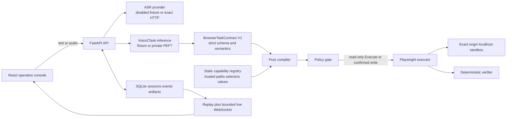
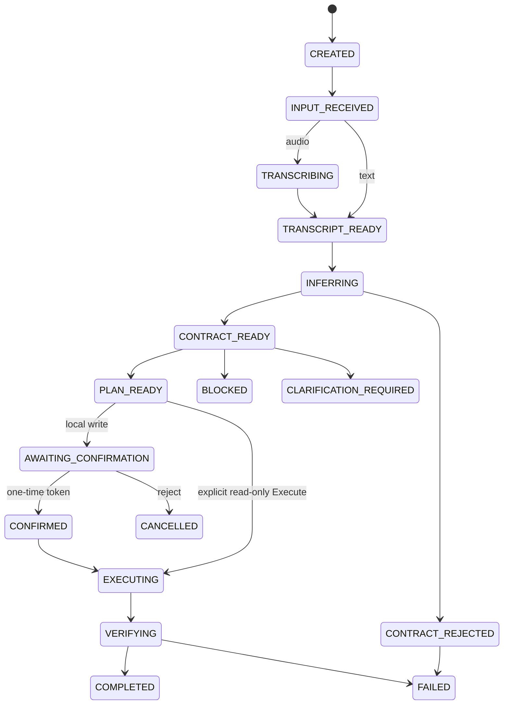

# Controlled Browser Demo Architecture

## Trust boundaries

`BrowserTaskContract V1` remains the model boundary. The compiler never interprets a model-authored selector or arbitrary URL; it maps a validated task and allowlisted slot into IDs owned by the static registry.

## Session lifecycle

The SQLite session row owns `last_event_seq`. State update and its event append share one `BEGIN IMMEDIATE` transaction, and `(session_id, seq)` is unique. `execution_claimed` atomically prevents a second active execution. Startup marks `TRANSCRIBING`, `INFERRING`, `EXECUTING`, and `VERIFYING` sessions `FAILED/SERVER_RESTART_INTERRUPTED`; it never replays browser actions.

## Capability registry

| Capability | Trusted path | Actions | Deterministic verifier |
| --- | --- | --- | --- |
| `demo_search` | `/sandbox/search` | navigate, fill, click | path, query value, results contain query |
| `demo_help` | `/sandbox/help` | navigate | path and heading |
| `demo_product` | `/sandbox/product` | navigate, extract text | extracted value equals non-empty DOM price + hash |
| `demo_profile_form` | `/sandbox/profile` | navigate, fill | confirmed email value; no save/submit |

The public plan contains only capability, action, locator and value-source IDs. Actual selectors and paths stay in trusted code. Plan IDs hash the canonical contract, persisted `SessionContext`, plan version, issued-at, and registry version; expiry is issued-at plus five minutes.

## Executor defenses

Policy validates expiry, route, capability, action kind, locator ID, value-source ID and confirmation before a BrowserContext exists. The executor then applies a second boundary:

1. new incognito BrowserContext per session;
2. exact configured origin plus `/sandbox/` request route only;
3. WebSocket, download, popup and file chooser blocking;
4. maximum five actions, 5-second action timeout and 20-second overall timeout;
5. action start/completion/failure events with no raw selector or disk path;
6. random-ID screenshots and session-scoped artifact lookup;
7. unconditional context close in `finally`, without cookies, storage state, trace or persistent profile.

Blocked and Clarify plans contain zero actions. Their verifier records `browser_context_created=false` and `action_count=0`.

## Process topology

The supported MVP topology is one Uvicorn worker. SQLite WAL is authoritative for history and replay; in-memory queues only carry current live events. WebSocket clients subscribe before replay, deduplicate by sequence, receive non-persistent heartbeat messages, and close normally after the terminal event is replayed. A full client queue removes only that subscriber.

## Claim boundary

The committed benchmark runs fixture inference, disabled ASR and real localhost Chromium. It is orchestration evidence only. Private PEFT is covered by fail-closed/mock tests without loading a private adapter or GPU. HTTP ASR is covered by typed mock transport tests without claiming a real ASR benchmark.
