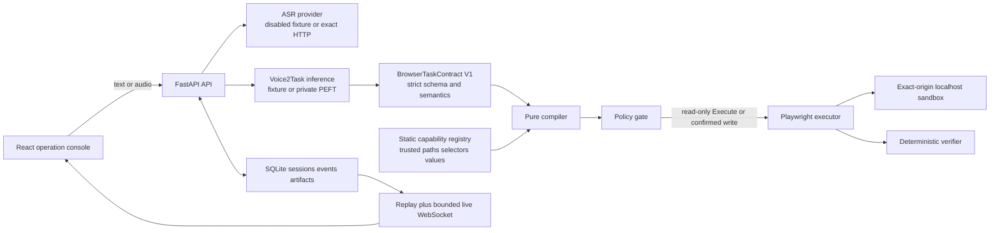
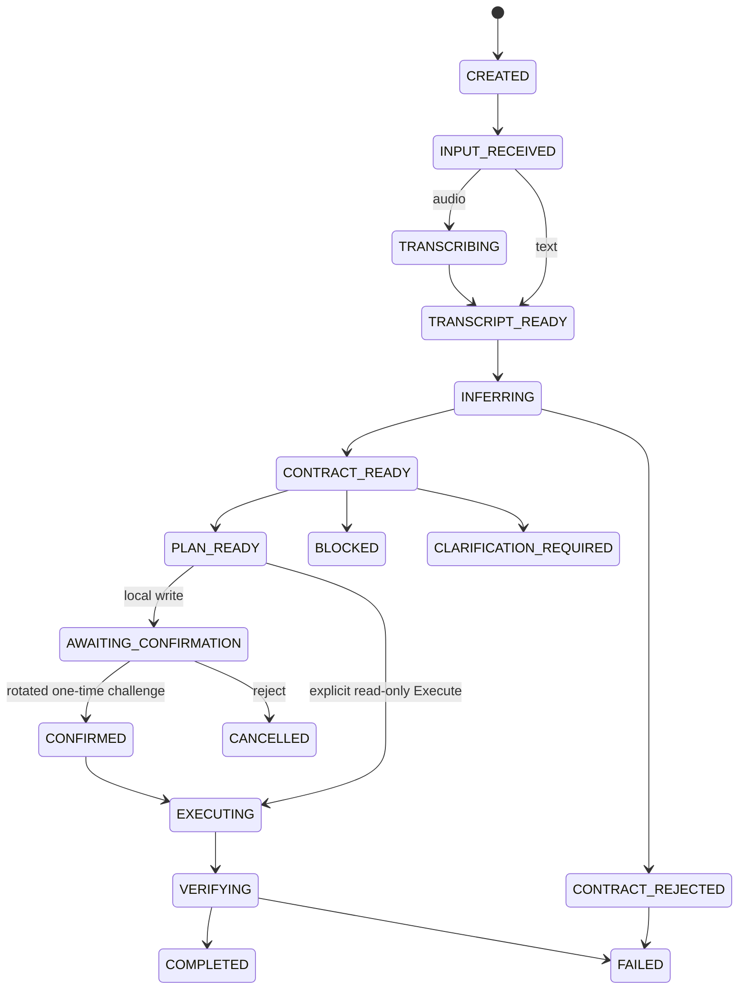

# Controlled Browser Demo Architecture

## Trust boundaries

`BrowserTaskContract V1` remains the model boundary. The compiler never interprets a model-authored selector or arbitrary URL; it maps a validated task and allowlisted slot into IDs owned by the static registry.

## Session lifecycle

Text/audio create and transcript confirmation return `202 Accepted` with the initial persisted snapshot. `SessionTaskRegistry` retains exactly one background operation for that session/stage while SQLite remains authoritative. A synchronous registration callback transfers staged-audio cleanup from request scope to task scope; cancellation before transfer runs request `finally`, and registered task completion owns later cleanup. The SQLite session row owns `last_event_seq`; state update and its event append share one `BEGIN IMMEDIATE` transaction, and `(session_id, seq)` is unique. Event strings/payloads are sanitized before insertion and defensively on read, so REST and WebSocket replay/live use the same public-safe record. `execution_claimed` atomically prevents a second active execution. Startup marks accepted input plus transient transcription, inference, compilation, execution, and verification states `FAILED/SERVER_RESTART_INTERRUPTED`; it never replays browser actions. Graceful shutdown cancels and awaits every owned task but preserves an audio transcript or plan/confirmation state that was already persisted at a resumable boundary.

For writes, create/transcript responses never expose a token. `POST .../confirmation-challenge` returns exactly token, plan ID/version, and expiry, stores only the hash, and rotates away any prior challenge. `/confirm` consumes the matching challenge and stops at `CONFIRMED`; only a separate `/execute` may claim work. Same-tab recovery uses `sessionStorage` only after rebinding to a fresh authoritative snapshot.

## Capability registry

| Capability | Trusted path | Actions | Deterministic verifier |
| --- | --- | --- | --- |
| `demo_search` | `/sandbox/search` | navigate, fill, click | path, query value, results contain query |
| `demo_help` | `/sandbox/help` | navigate | path and heading |
| `demo_product` | `/sandbox/product` | navigate, extract text | independent action output = fresh DOM = registry expected `¥199.00` |
| `demo_profile_form` | `/sandbox/profile` | navigate, fill | confirmed email value; no save/submit |

The public plan contains only capability, action, locator and value-source IDs. Actual selectors and paths stay in trusted code. Plan IDs hash the canonical contract, persisted `SessionContext`, plan version, issued-at, and registry version; expiry is issued-at plus five minutes.

## Executor defenses

Policy validates expiry, route, capability, action kind, locator ID, value-source ID and confirmation before a BrowserContext exists. The executor then applies a second boundary:

1. new incognito BrowserContext per session;
2. exact configured origin plus `/sandbox/` request route only;
3. WebSocket, download, popup and file chooser blocking;
4. maximum five actions, 5-second action timeout and 20-second overall timeout;
5. action start/completion/failure events with no raw selector or disk path;
6. random-ID screenshots and session-scoped artifact lookup;
7. unconditional context close in `finally`, without cookies, storage state, trace or persistent profile.

Blocked and Clarify plans contain zero actions. Their verifier records `browser_context_created=false` and `action_count=0`.

## Process topology

The supported MVP topology is one Uvicorn worker. SQLite WAL is authoritative for history and replay; the task registry owns accepted background coroutines and in-memory queues only carry current live events. WebSocket clients subscribe before replay, deduplicate by sequence, refresh the HTTP snapshot after state-bearing events, reject regressive `last_event_seq` responses, and refetch once when a concurrently loaded history snapshot trails the replay cursor. They receive non-persistent heartbeat messages and close normally after terminal replay. A full client queue removes only that subscriber.

`ExecutionEvidence` keeps `action_outputs` and a separately collected fresh `dom_snapshot`. Extract verification fails in a fixed order with `EXTRACT_ACTION_OUTPUT_MISSING`, `EXTRACT_DOM_SNAPSHOT_MISSING`, `EXTRACT_EVIDENCE_MISMATCH`, or `EXTRACT_EXPECTED_VALUE_MISMATCH`; later unrelated postcondition failure remains `VERIFICATION_FAILED`.

Raw audio is temporary. A microphone acquisition generation guard coalesces pending clicks and stops any stream that resolves after mode switch or unmount. Session metadata and screenshots remain only on the local machine until terminal-session deletion removes artifacts first and database rows second; unlink failure keeps rows and returns a controlled retryable error. The web client removes matching challenge state only after terminal/successful delete and never uses `localStorage`.

## Claim boundary

The committed benchmark runs fixture inference, disabled ASR and real localhost Chromium. It is orchestration evidence only. Private PEFT is covered by fail-closed/mock tests without loading a private adapter or GPU. HTTP ASR is covered by typed mock transport tests without claiming a real ASR benchmark.
