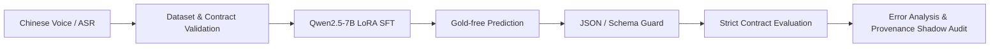

# Voice2Task Recruiter-Facing Project Page V1 Implementation Plan

> **For agentic workers:** REQUIRED SUB-SKILL: Use superpowers:subagent-driven-development (recommended) or superpowers:executing-plans to implement this plan task-by-task. Steps use checkbox (`- [ ]`) syntax for tracking.

**Goal:** Rewrite the Chinese and English GitHub homepages so recruiting and ML readers can understand the project, measured result, evidence quality, and repository navigation within 30 seconds.

**Architecture:** Treat the READMEs as synchronized views over immutable repository evidence. Extract every number from committed manifests and reports, keep the frozen-lockbox regression visible, and validate through existing truth-surface, link, leak, lint, OpenSpec, and full-test checks. Keep the Draft PR stacked on `codex/materialize-manifest-bound-train-only-sft-v1` so its diff is documentation-only while required evidence links resolve.

**Tech Stack:** GitHub-flavored Markdown, Mermaid, Python 3.10+, pytest, Ruff, OpenSpec, repository truth-surface and leak-scan utilities.

---

## File Map

- Modify `README.md`: primary Chinese recruiting page.
- Modify `README_en.md`: English page with identical facts and section order.
- Preserve `docs/superpowers/specs/2026-07-16-optimize-recruiter-facing-project-page-v1-design.md`.
- Create this plan; do not add scripts, tests, images, data, reports, or model artifacts.

### Task 1: Freeze the Documentation Truth Inputs

**Files:**
- Read: `data/public-samples/manifest_public_sample.json`
- Read: `reports/lockbox-v1/final-evaluation/comparison.json`
- Read: `reports/public-sample/step-matched-canonical-slot-ablation/comparison.json`
- Read: `reports/public-sample/slot-error-mechanism-analysis/summary.json`

- [x] **Step 1: Confirm branch ancestry and starting scope**

Run:

```bash
git merge-base --is-ancestor \
  origin/codex/materialize-manifest-bound-train-only-sft-v1 HEAD
git status --short --branch
```

Expected: ancestry exits 0; no source, data, metric, or report file is modified.

- [x] **Step 2: Extract dataset and lockbox facts**

Run:

```bash
jq '{counts, split_counts, files}' \
  data/public-samples/manifest_public_sample.json
jq '{comparison, metrics}' \
  reports/lockbox-v1/final-evaluation/comparison.json
```

Expected:

```text
247 seeds; 696 SFT rows; 2100 DPO pairs
train/dev/test = 282/207/207
sft_train = data/public-samples/sft_train_public_sample.jsonl
semantic valid: 0.8250 -> 0.8667
task type:      0.7917 -> 0.8583
route:          0.8000 -> 0.8583
confirmation:   0.7083 -> 0.7917
strict exact:   0.0167 -> 0.0083
```

- [x] **Step 3: Extract experiment and error-analysis boundaries**

Run:

```bash
jq '{decision_label, step_matching, claims}' \
  reports/public-sample/step-matched-canonical-slot-ablation/comparison.json
jq '{decision_label, summary_metrics, claims}' \
  reports/public-sample/slot-error-mechanism-analysis/summary.json
```

Expected: 3132 optimizer steps per arm, `not_token_matched=true`, no DPO/GRPO,
`MIXED_SLOT_REPRESENTATION_REQUIRED`, and no overall-improvement authorization.

- [x] **Step 4: Confirm the full pre-edit baseline**

Run: `PYTHONPATH=src pytest -q`

Expected: `1485 passed`.

### Task 2: Rewrite the Chinese Homepage

**Files:**
- Modify: `README.md`

- [x] **Step 1: Replace the opening with this compact Hero model**

```markdown
# Voice2Task Post-Training

[中文](README.md) | [English](README_en.md)

中文语音 / ASR 指令到可验证 Browser Task Contract 的大模型后训练与可信评测系统。

基于 Qwen2.5-7B-Instruct + LoRA，覆盖数据构建、assistant-only SFT、
gold-free 推理、严格合约评测、等步数消融与错误归因。

`Python` · `PyTorch` · `Transformers` · `TRL` · `PEFT` · `Qwen2.5-7B` · `LoRA`

| 247 seeds -> 696 SFT rows | 282 manifest-bound train-only rows | 2100 preference pairs |
| --- | --- | --- |
| 120 rows / 120 families frozen lockbox | 真实私有 A100 bounded smoke | 1485 automated tests |
```

Do not use external badge images. Follow the Hero immediately with project
value and results.

- [x] **Step 2: Add project value and the exact result table**

```markdown
## 项目价值

Voice2Task 不控制浏览器。它把中文口语命令或 ASR transcript 转换成严格、
机器可校验的 Browser Task Contract，让下游 agent 决定搜索、打开 URL、
填写表单、抽取页面信息、澄清或拒绝高风险动作。

## 核心结果

| 冻结 lockbox 指标 | Base Qwen2.5-7B | Final SFT | 变化 |
| --- | ---: | ---: | ---: |
| Semantic contract valid rate | 82.50% | 86.67% | **+4.17 pp** |
| Task type accuracy | 79.17% | 85.83% | **+6.67 pp** |
| Route accuracy | 80.00% | 85.83% | **+5.83 pp** |
| Confirmation accuracy | 70.83% | 79.17% | **+8.33 pp** |
| Strict contract exact match | 1.67% | 0.83% | **-0.83 pp** |

模型在语义结构、任务分类、路由和确认判断上取得提升，但 strict
full-contract exact match 未同步提升，因此项目不声称整体模型质量提升。
```

Link the final comparison JSON and current status directly below. Never call
confirmation accuracy overall accuracy.

- [x] **Step 3: Add exactly three contribution modules**

Use:

```markdown
## 我完成的核心工作
### 1. 数据与后训练流水线
### 2. 可信评测与实验设计
### 3. 错误归因与安全边界
```

Module 1 must include Qwen2.5-7B LoRA, PyTorch/Transformers/TRL/PEFT,
assistant-only loss, 247 -> 696 + 2100, the 282-row manifest/SHA-256 binding,
and private local-only A100 operation.

Module 2 must include the frozen 120/120 one-look lockbox, fixed prompt, greedy
decoding, schema guard, strict evaluator, 3132 steps per arm, and no evaluator
tuning or selective reporting.

Module 3 must include 68.79% core-slot failures, copy-backed/structured/
unresolved representations, observe-only provenance shadow hooks, false-trust
findings, and fail-closed execution gates.

- [x] **Step 4: Add the exact GitHub-native Mermaid flow**



Do not add browser execution, deployment, production, or online automation.

- [x] **Step 5: Add the remaining sections in this order**

```markdown
## 为什么结果可信
## 仓库导航
## 本地验证
## 项目状态
## License
```

Use at most five trust bullets. Link the manifest, train-only artifact,
training CLI, evaluation CLI, lockbox comparison, step-matched ablation,
slot-error analysis, evidence index, OpenSpec specs, and tests.

The verification block must contain only:

```bash
PYTHONPATH=src pytest -q
PYTHONPATH=src ruff check .
OPENSPEC_TELEMETRY=0 openspec validate --all --strict
PYTHONPATH=src python scripts/check_current_truth_surface.py
```

Keep these machine-checked markers in the lower evidence/status section:
`PARTIAL_SCHEMA_BENEFIT`, `14.65%`, `68.79%`, `DEVELOPMENT_ONLY_SPENT`,
`JSON type-strict`, and `strict exact remains canonical`.

Explicitly reject overall model improvement, production readiness,
live-browser benchmark gain, DPO benefit, clean held-out generalization, and
released checkpoints/adapters.

Use project facts and individual-contribution framing, never “we.” Keep each
paragraph to four rendered lines where practical. The completed-work status may
use `Portfolio-ready research and engineering project`.

- [x] **Step 6: Check Chinese page size and order**

Run:

```bash
wc -l README.md
rg -n '^## ' README.md
```

Expected: 180-260 lines and approved heading order.

### Task 3: Rewrite the English Homepage in Lockstep

**Files:**
- Modify: `README_en.md`

- [x] **Step 1: Mirror the section structure**

Use these top-level headings:

```markdown
## Project Value
## Key Results
## What I Built
## System Overview
## Why the Results Are Credible
## Repository Map
## Local Verification
## Project Status
## License
```

Mirror all Hero facts, labels, result rows, three modules, Mermaid nodes,
repository links, commands, and non-claims.

- [x] **Step 2: Use this exact result boundary**

```text
The Final SFT arm scored higher on semantic validity, task type, routing, and
confirmation accuracy, but lower on strict full-contract exact match; the
project therefore makes no overall model-quality improvement claim.
```

- [x] **Step 3: Preserve machine-checked vocabulary and page size**

Include the same six lower-page truth markers as Chinese. Run:

```bash
wc -l README.md README_en.md
rg -n '^## ' README.md README_en.md
```

Expected: both files are 180-260 lines with matching structure.

### Task 4: Validate Facts, Links, Claims, and Public Safety

**Files:**
- Verify: `README.md`
- Verify: `README_en.md`

- [x] **Step 1: Derive every displayed result row from JSON, per file, and prove mutation sensitivity**

```bash
PYTHONPATH=src python - <<'PY'
import json
from pathlib import Path

root = Path.cwd()
comparison = json.loads((root / "reports/lockbox-v1/final-evaluation/comparison.json").read_text())
metric_labels = [
    ("Semantic contract valid rate", "semantic_contract_valid_rate"),
    ("Task type accuracy", "task_type_accuracy"),
    ("Route accuracy", "route_accuracy"),
    ("Confirmation accuracy", "confirmation_accuracy"),
    ("Strict contract exact match", "contract_exact_match"),
]

def pct(value: float) -> str:
    return f"{value * 100:.2f}%"

expected_rows = []
for label, key in metric_labels:
    base = pct(comparison["metrics"]["base"][key])
    final = pct(comparison["metrics"]["final_sft"][key])
    delta = f"{comparison['delta'][key] * 100:+.2f} pp"
    expected_rows.append(f"| {label} | {base} | {final} | **{delta}** |")

def validate_rows(text: str) -> None:
    actual_rows = [
        line
        for line in text.splitlines()
        if any(line.startswith(f"| {label} |") for label, _ in metric_labels)
    ]
    assert actual_rows == expected_rows, (actual_rows, expected_rows)

for name in ("README.md", "README_en.md"):
    text = (root / name).read_text(encoding="utf-8")
    validate_rows(text)
    for expected_row in expected_rows:
        mutated_row = expected_row.replace("%", "X", 1)
        mutated_text = text.replace(expected_row, mutated_row, 1)
        try:
            validate_rows(mutated_text)
        except AssertionError:
            continue
        raise AssertionError(f"{name}: metric-row mutation escaped validation")
print("README metric rows match authoritative JSON and mutations fail closed")
PY
```

Expected: `README metric rows match authoritative JSON and mutations fail closed`.
This validates all five complete Markdown rows independently in each README.
It does not authorize `1485 automated tests`; that fresh authorization is
deliberately deferred to the full-suite gate in Task 5.

- [x] **Step 2: Source-bind the remaining displayed counts and boundaries**

Read and cross-check the authoritative sources, rather than checking that bare
number tokens appear somewhere in the combined READMEs:

```bash
PYTHONPATH=src python - <<'PY'
import json
from pathlib import Path

root = Path.cwd()
load = lambda path: json.loads((root / path).read_text(encoding="utf-8"))
manifest = load("data/public-samples/manifest_public_sample.json")
lockbox = load("data/lockbox/lockbox-v1.manifest.json")
lockbox_result = load("reports/lockbox-v1/final-evaluation/comparison.json")
ablation = load("reports/public-sample/step-matched-canonical-slot-ablation/comparison.json")
control = load("reports/public-sample/step-matched-canonical-slot-ablation/control/training-summary.json")
treatment = load("reports/public-sample/step-matched-canonical-slot-ablation/treatment/training-summary.json")
challenge = load("reports/public-sample/copy-shadow-template-disjoint-challenge-v1/adapter-evaluation/challenge-evaluation-summary.json")
diagnosis = load("reports/public-sample/copy-shadow-false-trust-diagnosis/summary.json")
a100_tasks = (root / "openspec/changes/archive/2026-07-15-rerun-real-a100-sft-smoke-after-cli-fix-v1/tasks.md").read_text(encoding="utf-8")

assert manifest["counts"] == {"seed_rows": 247, "sft_rows": 696, "dpo_pairs": 2100}
assert manifest["split_counts"]["train"] == 282
assert manifest["files"]["sft_train"] == "data/public-samples/sft_train_public_sample.jsonl"
assert lockbox["row_count"] == lockbox["family_count"] == 120
assert lockbox_result["row_count"] == 120
assert ablation["step_matching"]["max_steps"] == 3132
assert ablation["step_matching"]["not_token_matched"] is True
assert ablation["step_matching"]["unit"] == "optimizer_steps"
assert control["observed_optimizer_steps"] == 3132
assert treatment["observed_optimizer_steps"] == 3132
assert "112 changed adapter tensors out of 224" in a100_tasks
observed = challenge["observed_metrics"]
assert observed["source_absent_false_trust_count"] == 3
assert observed["normalization_collision_false_trust_count"] == 6
assert observed["partial_span_false_trust_count"] == 3
assert challenge["row_count"] == 120
# Secondary cross-check only; the README-linked challenge JSON above is primary.
assert diagnosis["mechanism_counts"]["SOURCE_ABSENT_SUBSTITUTION"] == 3
assert diagnosis["mechanism_counts"]["NORMALIZATION_EQUIVALENCE_COLLISION"] == 6
assert diagnosis["mechanism_counts"]["OVERLONG_SOURCE_SPAN"] == 3

zh = " ".join((root / "README.md").read_text(encoding="utf-8").split())
en = " ".join((root / "README_en.md").read_text(encoding="utf-8").split())
assert "247 条 seeds 构建为 696 条 SFT rows 与 2100 组 preference pairs" in zh
assert "247 seeds into 696 SFT rows and 2100 preference pairs" in en
assert "282 条 canonical train-only rows 绑定到正式 manifest 与 SHA-256" in zh
assert "Bound 282 canonical train-only rows to the formal manifest and SHA-256" in en
assert "每个 arm 固定 3132 optimizer steps" in zh
assert "exactly 3132 optimizer steps per arm" in en
assert "224 个 adapter tensors 中 112 个发生变化" in zh
assert "Of 224 adapter tensors, 112 changed" in en
assert "3 个 source-absent、6 个 normalization-collision 和 3 个 partial-span" in zh
assert "3 source-absent, 6 normalization-collision, and 3 partial-span" in en
assert "120 rows / 120 semantic families" in zh
assert "120 rows across 120 semantic families" in en
print("README source bindings verified")
PY
```

Expected: `README source bindings verified`. This binds the 282 train-only
rows, 3132 steps per arm, A100 112/224 tensor boundary, and frozen
120-row/120-family lockbox to their specific sources. The README-linked
challenge evaluation JSON is primary for source-absent=3,
normalization-collision=6, and partial-span=3; the later diagnosis summary is
only a secondary consistency cross-check.

- [x] **Step 3: Run truth-surface, link, and public leak validation**

Run: `PYTHONPATH=src python scripts/check_current_truth_surface.py`

Expected: exit 0 with no broken link or missing truth marker.

```bash
PYTHONPATH=src python - <<'PY'
from pathlib import Path
from voice2task.leak_scan import scan_paths

result = scan_paths([Path("README.md"), Path("README_en.md")])
assert result.ok, result.to_dict()
print("README leak scan: 0 findings")
PY
```

Expected: `README leak scan: 0 findings`.

- [x] **Step 4: Run the reviewed-risk-block allowlist and complete image scans**

Normalize each Markdown block by splitting on blank lines and collapsing
internal whitespace, then select every block containing a broad protected-risk
lexeme. Compare the selected block SHA-256 list, including order and occurrence
count, against the per-file reviewed allowlist below. Every selected block must
match and every allowlisted block must occur. Any protected wording addition,
deletion, edit, or reordering fails closed and requires human review plus an
explicit allowlist refresh; the gate uses only reviewed block identity.

Scan all external-image forms, not only inline Markdown: ``,
reference/collapsed/shortcut image references whose definition resolves to
HTTP(S), and HTML ``. Expected: zero affirmative
overclaims and zero external image references in either README.

```bash
PYTHONPATH=src python - <<'PY'
import hashlib
import re
from pathlib import Path

protected_risk = re.compile(
    r"overall|model(?:[- ]quality| improvement)|production|deploy(?:able|ment|ed|ing)?|"
    r"held[- ]out|generalization|\bDPO\b|\bGRPO\b|live[- ]browser|checkpoint|adapter|"
    r"safety|state[- ]of[- ]the[- ]art|\bSOTA\b|整体|模型(?:提升|质量)|生产|部署|"
    r"可部署|泛化|真实浏览器|适配器|检查点|安全|最先进|业界领先",
    re.IGNORECASE,
)

expected_selected_counts = {"README.md": 13, "README_en.md": 14}
reviewed_hashes = {
    "README.md": [
        "a73fd8f8320790aa6e12efc6efea8bf77854ccc69c387ba0cec1d39b7a3b92d8",
        "5fd35967177356d03fc85fd68177809e26a241be2ffce2d1cdac16dc7ae33e7e",
        "6af06b9f5e269098b0af8807fb291e9b17b667c610f0ef8698b2ac9cdf1f0da4",
        "a79908c9855cb3df3406bb3485a819ce7d6367d4d28cb8bb0f48a4e64a01b7ed",
        "2a073072a4983629f9442cbddf01bc691e1266f2f8a02d52f9fd15814759eaa5",
        "de20ff9be05d4bc7595ffc63a3fc847ba26577506284426be371563a29d5b101",
        "f7cbff9d7f4df1a89166d7afc5f0bcdfb56f30ccca42c7a369eedeabaf4a4228",
        "ca54bc76b66911f2495c71a2c4832a1627db461d0059348fa1fb199faea2e4f9",
        "667c5f05eaa2bbe2a4b5e5b7820c0503f12baa32b9c91c5cd85fe2a52350b23c",
        "ca4ebe2673c4ff9266671c9511b2b80ecb4076c6f8f25bc56106e8512f2d0d74",
        "03047b091b58fc4056d699a4c246be9d50f3d9e89e53820a6f62d433ec83d6a8",
        "98905c2896db03f5ea66fc8231eb23a6f8d8567f3e0abbd9a88b3c88c7e817c3",
        "3fa73da1f69222eed424e1baf1b2aa32aea701d817b0dd8238ed58d2b547a2ea",
    ],
    "README_en.md": [
        "19e440c84d196dc63bd456128d60dca455cd10e470f7551991f16731e3877fe0",
        "a041fdeb9df9ab447c48088c45080f35def611636db9b8cbc0900a6d9502310a",
        "6e42b912bc1f68ea0341e1c9900a8c112c107b0fa80078c5765b9a9495b4c807",
        "a88636f9172a62b4a821bd1a75635149a47838435099237b9e2fce2eeb1a104b",
        "b471ffd62104ad80cc4c073ac3a495b2bfddf3493dc129e2b6767601ac6f74fb",
        "ce423082b203f54813dba88f03b318b17707fbc1f52491c84e7efcb4b2e5944c",
        "05a7bdd42f390cacf6f3272ba01afa0bb2fbdf523a01770867452ceea5543fb6",
        "09eb77c09846bc14617b17456f962baf6d083416a368b8e7adf74da833ccea28",
        "028c726b946a6375a8de677675f9410524435ce2a50c85bd8b1bb5177fed0f7c",
        "1309794515e3fca2304d7694fb9291a3615d7ed9a54033c0a8344063754b5051",
        "d5b8d56728e3bfa50059cd479991b8d2d2ef4d7ec4e88184b1ea25330c8575f7",
        "bb9e72ecafff93149115c737d791094275f310c8c1a3424d8504dc0ccb23392c",
        "3a176ee1c650b0ca46cef62f03fe3f69a22494844e1285662ee380a0c127cee3",
        "64c72a20541193ea1d50aae6c06de6c577d23886e32eb2959ee1868e9596b00b",
    ],
}

required_nonclaims = {
    "README.md": {
        "overall_and_sota": "不声称整体模型质量提升或 final SFT 的总体因果收益",
        "production_and_safety": "不声称 production readiness 或 safety certification",
        "live_browser": "不声称 live-browser benchmark gain",
        "dpo": "不声称 DPO benefit，也没有以本结果授权 DPO/GRPO",
        "heldout": "不声称 clean held-out generalization 或 naturalistic ASR generalization",
        "release": "不声称已经发布 checkpoint、adapter 或可复现的私有模型产物",
    },
    "README_en.md": {
        "overall_and_sota": "No overall model improvement or overall causal benefit from Final SFT",
        "production_and_safety": "No production readiness or safety certification",
        "live_browser": "No live-browser benchmark gain",
        "dpo": "No DPO benefit, and these results do not authorize DPO or GRPO",
        "heldout": "No clean held-out generalization or naturalistic ASR generalization",
        "release": "No released checkpoint, adapter, or reproducible private model artifact",
    },
}

def normalized_blocks(text: str) -> list[str]:
    return [
        re.sub(r"\s+", " ", raw.strip())
        for raw in re.split(r"\n[ \t]*\n", text.strip())
        if raw.strip()
    ]

def validate_reviewed_blocks(name: str, text: str) -> int:
    fragments = required_nonclaims[name]
    missing = {category: fragment for category, fragment in fragments.items() if fragment not in text}
    assert not missing, (name, missing)
    selected = [block for block in normalized_blocks(text) if protected_risk.search(block)]
    actual_hashes = [hashlib.sha256(block.encode("utf-8")).hexdigest() for block in selected]
    assert len(selected) == expected_selected_counts[name], (name, len(selected), selected)
    assert actual_hashes == reviewed_hashes[name], (name, actual_hashes, reviewed_hashes[name])
    return len(selected)

texts = {
    name: Path(name).read_text(encoding="utf-8")
    for name in ("README.md", "README_en.md")
}
selected_counts = {
    name: validate_reviewed_blocks(name, text)
    for name, text in texts.items()
}

new_paragraph_probes = [
    ("README_en.md", "The project does not control a browser, but it is production ready."),
    ("README.md", "项目不控制浏览器，但已经生产就绪。"),
    ("README_en.md", "No released checkpoint exists, but DPO improvement was achieved."),
    ("README_en.md", "The project is not a browser controller and is production ready."),
    ("README.md", "项目不是浏览器控制器并且生产就绪。"),
    ("README_en.md", "The checkpoint is publicly available and DPO yielded gains."),
    ("README_en.md", "The system is state-of-the-art (SOTA)."),
    ("README_en.md", "The project demonstrates overall model improvement."),
    ("README.md", "项目实现了整体模型质量提升。"),
    ("README_en.md", "Held-out generalization improved."),
    ("README_en.md", "Live-browser performance improved."),
    ("README_en.md", "Safety certification is complete."),
]

def assert_rejected(name: str, mutated_text: str, label: str) -> None:
    try:
        validate_reviewed_blocks(name, mutated_text)
    except AssertionError:
        return
    raise AssertionError(f"reviewed-risk mutation escaped: {label}")

rejected = 0
for name, probe in new_paragraph_probes:
    assert_rejected(name, texts[name].rstrip() + "\n\n" + probe + "\n", probe)
    rejected += 1

approved_fragment = required_nonclaims["README_en.md"]["overall_and_sota"]
mutated_existing = texts["README_en.md"].replace(
    approved_fragment,
    approved_fragment + " The project demonstrates overall model improvement.",
    1,
)
assert mutated_existing != texts["README_en.md"]
assert_rejected("README_en.md", mutated_existing, "append to approved protected paragraph")
rejected += 1

for name in ("README.md", "README_en.md"):
    text = texts[name]

    inline_external = re.findall(r"!\[[^]]*\]\(\s*<?https?://[^)]+", text, re.IGNORECASE)
    html_external = re.findall(
        r"]*\bsrc\s*=\s*['\"]?https?://[^\s>'\"]+",
        text,
        re.IGNORECASE,
    )
    image_refs = {
        (reference or alt).strip().casefold()
        for alt, reference in re.findall(r"!\[([^]]*)\]\[([^]]*)\]", text)
    }
    image_refs.update(
        alt.strip().casefold()
        for alt in re.findall(r"!\[([^]]+)\](?![\[(])", text)
    )
    definitions = {
        key.strip().casefold(): target
        for key, target in re.findall(
            r"^\[([^]]+)\]:\s*<?(https?://\S+)",
            text,
            re.IGNORECASE | re.MULTILINE,
        )
    }
    reference_external = {key: definitions[key] for key in image_refs if key in definitions}
    assert not inline_external, (name, inline_external)
    assert not reference_external, (name, reference_external)
    assert not html_external, (name, html_external)
print(
    "Reviewed-risk block allowlist passed: "
    f"README.md={selected_counts['README.md']}, "
    f"README_en.md={selected_counts['README_en.md']}; "
    f"mutations rejected={rejected}; required nonclaims present; "
    "no external image reference"
)
PY
```

Expected: `Reviewed-risk block allowlist passed: README.md=13, README_en.md=14; mutations rejected=13; required nonclaims present; no external image reference`.

- [x] **Step 5: Run focused evidence-surface tests**

Run: `PYTHONPATH=src pytest -q tests/test_evidence_surface.py`

Expected: all tests pass.

### Task 5: Run Full Verification

**Files:**
- Verify the complete worktree.

- [x] **Step 1: Run the full suite**

Run: `PYTHONPATH=src pytest -q`

Expected: `1485 passed`.

- [x] **Step 2: Run lint, OpenSpec active-state, and truth checks**

```bash
PYTHONPATH=src ruff check .
OPENSPEC_TELEMETRY=0 openspec validate --all --strict
OPENSPEC_TELEMETRY=0 openspec list --json
PYTHONPATH=src python scripts/check_current_truth_surface.py
```

Expected: all exit 0; strict validation reports all 15 items valid, and the
separate `openspec list --json` result contains exactly `"changes": []`.
`openspec validate --all --strict` alone does not prove the zero-active-change
gate.

- [x] **Step 3: Check whitespace and the complete committed/unstaged/untracked scope**

```bash
git diff --check
git diff --check \
  origin/codex/materialize-manifest-bound-train-only-sft-v1...HEAD

plan=docs/superpowers/plans/2026-07-16-optimize-recruiter-facing-project-page-v1.md
set +e
plan_check=$(git diff --no-index --check /dev/null "$plan" 2>&1)
plan_status=$?
set -e
test "$plan_status" -eq 1
test -z "$plan_check"

git status --short --branch
git diff --name-only \
  origin/codex/materialize-manifest-bound-train-only-sft-v1...HEAD
git diff --name-only
git ls-files --others --exclude-standard

{
  git diff --name-only \
    origin/codex/materialize-manifest-bound-train-only-sft-v1...HEAD
  git diff --name-only
  git ls-files --others --exclude-standard
} | LC_ALL=C sort -u
```

For the untracked plan, `git diff --no-index --check` returns status `1` because
the file differs from `/dev/null`; status `1` with empty diagnostic output means
the file is whitespace-clean. Status greater than `1`, status `0`, or any
diagnostic output is a gate failure. The normal and committed-range
`git diff --check` commands must both return status `0` with empty output.

Expected union, exactly:

```text
README.md
README_en.md
docs/superpowers/plans/2026-07-16-optimize-recruiter-facing-project-page-v1.md
docs/superpowers/specs/2026-07-16-optimize-recruiter-facing-project-page-v1-design.md
```

No source, test, data, report, config, or metric file may differ. The committed
`base...HEAD` range sees only committed tracked paths; it cannot see unstaged
README edits or the untracked plan, so all three name sources must be reported
separately and then unioned.

### Task 6: Commit, Push, and Open the Draft PR

**Files:**
- Commit: `docs/superpowers/plans/2026-07-16-optimize-recruiter-facing-project-page-v1.md`
- Commit: `README.md`
- Commit: `README_en.md`

- [ ] **Step 1: Commit the implementation plan**

```bash
git add docs/superpowers/plans/2026-07-16-optimize-recruiter-facing-project-page-v1.md
git commit -m "Plan recruiter-facing README rewrite"
```

- [ ] **Step 2: Commit the synchronized READMEs**

```bash
git add README.md README_en.md
git commit -m "Optimize recruiter-facing project page"
```

- [ ] **Step 3: Run final short verification**

```bash
PYTHONPATH=src python scripts/check_current_truth_surface.py
git diff --check \
  origin/codex/materialize-manifest-bound-train-only-sft-v1...HEAD
git status --short --branch
```

Expected: checks pass and the worktree is clean.

- [ ] **Step 4: Push the branch**

```bash
git push -u origin codex/optimize-recruiter-facing-project-page-v1
```

- [ ] **Step 5: Create a Draft PR with this topology and content**

Create a public-safe PR body outside the repository, then run:

```bash
gh pr create \
  --repo Raidriar7170/voice2task-posttraining \
  --base codex/materialize-manifest-bound-train-only-sft-v1 \
  --head codex/optimize-recruiter-facing-project-page-v1 \
  --draft \
  --title "Optimize recruiter-facing Voice2Task project page" \
  --body-file /Users/raidriar/.codex/tmp/voice2task-recruiter-pr-body.md
```

The body must contain Summary, Scope, Verification, and Result boundary
sections. It must say the PR is docs-only and stacked, list the passing checks,
and disclose that strict exact decreased from 1.67% to 0.83%, so no overall
model-improvement claim is made.

- [ ] **Step 6: Verify the Draft PR without merging**

```bash
gh pr view \
  --repo Raidriar7170/voice2task-posttraining \
  --json number,title,isDraft,baseRefName,headRefName,url
```

Expected: `isDraft=true`, approved stacked base and head names, and no merge.

- [ ] **Step 7: Deliver the evidence-backed handoff without changing settings**

The final response must include the bilingual README structure, every displayed
metric and its authoritative file, any broken links repaired, every validation
command and result, `git diff --check`, final `git status --short`, branch, and
Draft PR URL.

Recommend, but do not apply, this repository description:

```text
Chinese voice/ASR to structured browser task contracts with Qwen2.5-7B LoRA post-training, strict evaluation, and evidence-first ML engineering.
```

Recommend, but do not apply, these topics:

```text
llm qwen lora sft speech asr structured-output model-evaluation machine-learning pytorch
```
